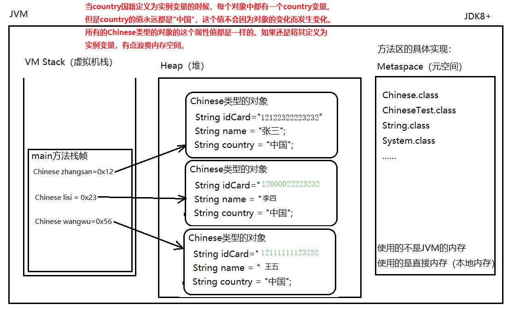
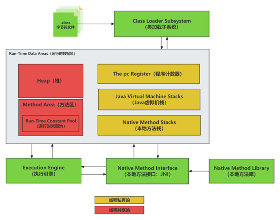
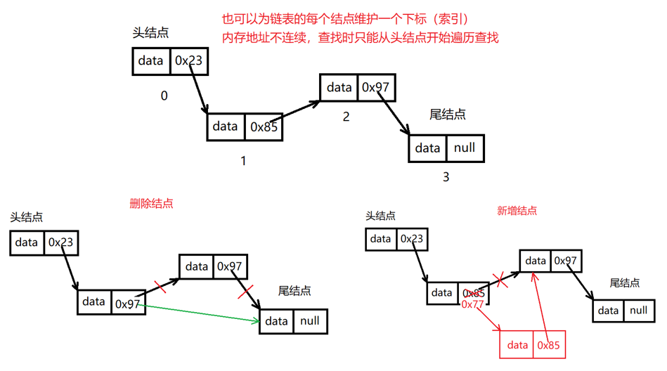
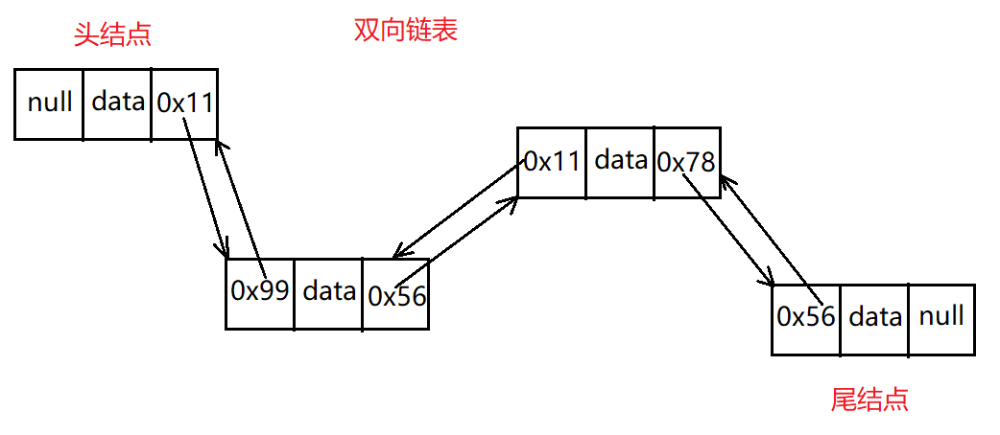
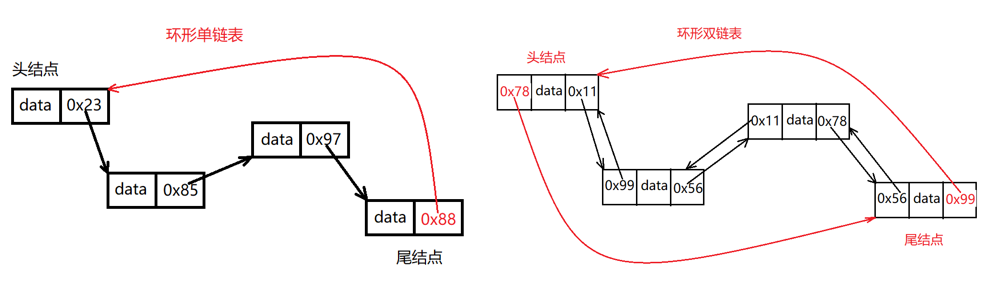
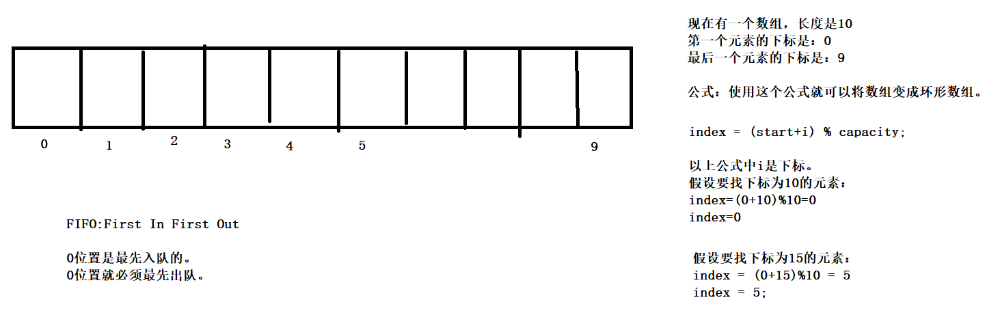
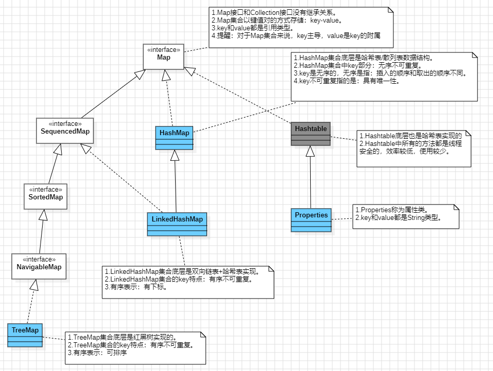
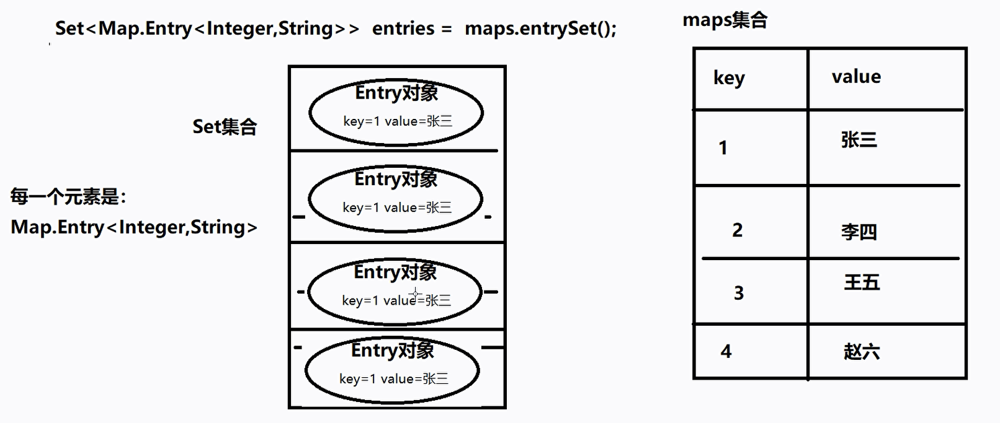

# Java基础知识

## 1. 概览

### 1.1. 关键笔记

🥑String、StringBuffer、StringBuilder的区别

🥑接口和抽象类的区别

🥑Java常见的异常类有哪些

🥑说一说Java面向对象三大特性

🥑说一说你对Java多态的理解

🥑重写和重载的区别

🥑final关键字有什么作用

🥑java中==和EQUALS的区别

🥑Java的集合类有哪些，那些是线程安全的，那些是线程不安全的

🥑ArrayList和Array有什么区别？ArrayList和LinkedList的区别是什么？

🥑ArrayList的扩容机制

🥑Java中的HashMap了解吗？HashMap的底层实现是什么？

🥑解决Hash冲突的方法有哪些？HashMap是如何解决hash冲突的

🥑HashMap的put方法流程

🥑HashMap的扩容机制

🥑HashMap为什么是线程不安全的？如何实现线程安全

🥑concurrentHashMap如何保证线程安全

🥑HashMap和ConcurrentHashMap的区别

🥑HashSet和HashMap的区别

🥑HashMap和HashTable的区别

## 2. 面相对象


### 2.1. 类和对象

**类** = **属性 + 方法** + 构造方法 + 静态成员 + 访问控制 + ...（模板化定义）

**对象** = **实例（instance）**= 实例变量（状态） + 对类中方法的引用，实例方法（行为） + 对象头（JVM 管理信息）

### 2.2. 对象的创建和使用

#### 2.2.1. 对象 & 引用

**引用**：引用本质上是一个 **变量**，这个变量中保存了 **对象的地址**，这个地址就是Java对象在堆内存中的位置

**对象**：对象在堆内存中，`new` 出来的

> Java中无法直接操作堆内存，只能通过引用来访问堆内存
>
> 两种访问方式：
> - 读取：引用.变量名 `s1.name; s1.age = 18;`
> - 修改：引用.变量名 = 新值 `s1.name = "zhangsan"; s1.age = 22;`

#####  2.2.1.1. new 运算符

1. **分配内存**：在 **堆内存** 中给对象分配一块连续的内存(所有使用 `new` 运算符创建的对象都存储在堆中)
2. **初始化对象**：
   - 设置对象的对象头（存储类指针、GC信息、锁状态等元数据）
   - 初始化对象的实例变量（成员变量），赋予默认值（如 `int` 初始化为0，引用初始化为 `null`）
   - 调用对象的构造方法（`<init>` 方法），进一步初始化对象状态
3. **返回对象引用**：将堆内存中对象的地址赋值给 **引用变量**（存储在栈帧或堆中的其他对象内）

##### 2.2.1.2. 空指针异常

当引用为空时（`引用 = null`），表示引用不再指向对象

访问引用的成员变量或方法，编译可以通过，但运行时会出现异常：`NullPointerException` 空指针异常

如果没有任何引用指向某一个对象，该对象最终会被当做垃圾，被垃圾回收器 `GC` 回收

#### 2.2.2. 🤔对象的内存分析

##### 2.2.2.1. 实例变量

**实例变量** 存储在 JVM堆内存 的 **Java对象** 内部

- **实例变量**（Instance Variables）是类的成员变量，定义在类中但不在任何方法内 
  - 实例变量在对象中，需要用 `引用.实例变量名` 来访问，不可以直接用 `类名.实例变量名` 访问，只有先有对象才有实例变量
- **特点**：  
  - 每个对象拥有独立的实例变量副本
  - 生命周期与对象一致，对象被垃圾回收时，其实例变量占用的内存才会释放
  - 可以是基本类型（如`int`、`double`）或引用类型（如`String`、自定义类）
- **存储方式**：
  - **基本类型**：直接存储值
    - 例如：`int age = 25;` → 在实例数据区占用4字节
  - **引用类型**：存储指向堆中另一个对象的地址（引用）
    - 例如：`String name = "Alice";` → 存储的是指向堆中`String`对象的引用（通常4字节或8字节，取决于JVM位数）

```
+-----------------------+
|      对象头（16字节）     |
+-----------------------+
| name（引用，4字节）       | → 指向堆中的String对象"Alice"，存的是一个地址
| age（int，4字节）         | → 直接存储25
+-----------------------+
| 对齐填充（可选）          |
+-----------------------+
```

**变量对比**：

| **变量类型** | **存储位置**       | **生命周期**               | **示例**              |
|--------------|--------------------|--------------------------|-----------------------|
| 实例变量      | 堆中的对象内部      | 与对象共存亡               | `class A { int x; }`  |
| 局部变量      | 虚拟机栈的栈帧中    | 方法执行期间存在           | `void foo() { int y; }` |
| 静态变量      | 元空间（方法区）    | 与类共存亡（类卸载时释放）   | `static int z;`       |


##### 2.2.2.2. 实例方法

**实例方法** 是与对象关联的方法，需要通过对象实例调用（如 `obj.method()`）

- 特点：
  - 每个实例方法隐含一个 `this` 引用，指向调用该方法的对象
  - 方法的代码逻辑是**共享的**，所有对象实例共享同一份方法字节码
- 存储：
  - **方法代码（字节码）**：
    - **元空间** 中存储所有方法的 **字节码** 和 **元数据**（方法名、参数类型、返回类型、访问修饰符、异常表等）
    - 所有对象实例共享同一份方法代码，无需重复存储
  - 方法执行时的 **数据**：方法调用时的局部变量、操作数栈等存储在 **虚拟机栈的栈帧** 中
- 执行过程
  1. **创建栈帧**：在调用线程的**虚拟机栈**中压入一个栈帧，存储方法的局部变量、操作数栈等信息
  2. **传递 `this` 引用**：将调用方法的对象地址（即 `this`）作为隐含参数传递给栈帧的局部变量表
  3. **执行字节码**：从元空间加载方法字节码，在操作数栈中执行指令
  4. **方法返回**：栈帧弹出，释放内存。

**实例方法与静态方法的存储对比**

| **对比项**       | **实例方法**                     | **静态方法**                     |
|------------------|----------------------------------|----------------------------------|
| **存储位置**      | 元空间（方法代码）                | 元空间（方法代码）                |
| **调用方式**      | 需对象实例（隐含 `this`）         | 直接 **通过类名调用**（无 `this`）     |
| **局部变量表**    | 包含 `this` 引用                  | 不包含 `this`                    |
| **访问权限**      | 可访问实例变量和静态变量           | 只能访问静态变量                  |

#### 2.2.3. 🤔相关JVM内存区域

**JVM内存核心区域划分**

* **堆**（Heap）
* **虚拟机栈**（VM Stack）
* **本地方法栈**（Native Method Stack）
* **程序计数器**（Program Counter Register, The PC Register）
* **运行时常量池** (Run-Time Constant Pool)
* **方法区**（Method Area）【规范，由元空间实现】

JVM中有GC机制，垃圾回收机制，java是自动垃圾回收（自动垃圾回收主要针对的是堆区，堆是动态分配对象内存的区域，对象生命周期不确定，是GC的核心目标）

对象的内存分析主要涉及 **堆**、**方法区（元空间）**、**虚拟机栈**

##### 2.2.3.1. 方法区 & 元空间 & 永久代

**方法区**（Method Area） 是 JVM 运行时的一块逻辑区域（JVM规范中的叫法），主要存储类的 **元数据（Metadata）**，包括：

* 已加载的类信息（Class Metadata）
* 运行时常量池（Runtime Constant Pool）
* 静态变量（Static Variables）
* JIT 编译后的代码（JIT-compiled Code）

- 特点
  - 方法区是逻辑概念，具体实现方式依赖 JVM 版本
  * 它是所有线程共享的
  * 方法区可以在垃圾回收（GC）过程中回收废弃的类信息
  
> JVM是一套规范，各个厂家都可以根据这个规范去实现具体的Java虚拟机

**元空间**（Metaspace） 和 **永久代**（Permanent Generation，PermGen） 是对方法区的实现

* 永久代: ≤Java7
  * 大小固定，容易导致 OOM（OutOfMemoryError: PermGen space）
* 元空间: ≥Java8
  * 大小可动态调整，不会出现 OOM
  * **不使用堆内存**，而是使用 **本地内存（Native Memory）**

##### 2.2.3.2. 虚拟机栈（VM Stack）

虚拟机栈是JVM为 **每个线程** 分配的私有内存区域，用于支持方法调用和执行

* **线程私有**：每个线程在创建时都会生成一个独立的虚拟机栈。

* **栈结构**：采用后进先出（LIFO） 的数据结构，存储方法调用的 **栈帧（Frame）**。

* **生命周期**：与线程共存亡，线程结束时栈内存自动释放

**栈帧** 的结构：

```
+-----------------------+
|     **局部变量表**       | → 存储方法的参数和局部变量
+-----------------------+
|     **操作数栈**         | → 执行字节码指令的临时工作区
+-----------------------+
|     **动态链接**         | → 指向方法区中方法的符号引用
+-----------------------+
|     **方法返回地址**      | → 记录方法执行完毕后应返回的位置
+-----------------------+
|     附加信息（可选）      | → 如调试信息、异常表等
+-----------------------+
```

##### 2.2.3.3. 堆（Heap）

**Java对象在堆内存中的结构**

```
+-----------------------+
|      对象头（Header）     | → 存储类指针、GC标记、锁状态等元数据
+-----------------------+
|   实例数据（Instance Data） | → 存储所有实例变量（核心部分）
+-----------------------+
|   对齐填充（Padding）      | → 确保对象内存对齐（由JVM按需添加）
+-----------------------+
```

#### 2.2.4. 方法调用时数据的传递

在方法调用时，参数传递始终是 **按值传递（Pass by Value）**，无论参数是 **基本类型** 还是 **对象引用**，传递的都是当前变量 **值** 的 **副本** ❗（复制一份传过去）

- **基本数据类型** 副本是原始值的独立拷贝，方法内修改副本不影响原始变量

  ```java
  public class Test {
      public static void main(String[] args) {
          int a = 10;
          change(a);
          // 相当于 int b = a;
          // change(b); 复制一个 a 传给change
          System.out.println("main: " + a);
      }
      public static void change(int a) {
          a = 20;
          System.out.println("change: " + a);
      }
  }
  ```
  输出结果：
  ```
  main: 10
  change: 20
  ```

- **引用数据类型** 副本是原引用地址的拷贝，传递的是 **对象引用** 的值，而引用的值是一个 **地址**，方法内通过副本修改对象状态会影响原对象，但重新赋值副本（如指向新对象）不影响原引用

  ```java
  public class Test {
      public static void main(String[] args) {
          User a = new User();
          a.age = 10;
          change(a);
          System.out.println("main: " + a.age);
      }
      public static void change(User a) {
          a.age = 20;
          System.out.println("change: " + a.age);
      }
  }
  ```

`this` 本质上也是一个引用
`this` 中保存的是 **当前对象的地址**（保存在方法栈的0号帧中）
`this.` 大部分时间可以省略，但用来区分局部变量和实例变量的时候不可以省略


### 2.3. 面向对象三大特性

1. 封装（Encapsulation）
2. 继承（Inheritance）
3. 多态（Polymorphism）

#### 2.3.1. 封装

实现封装的步骤:
1️⃣第一步：**属性私有化**。（什么是私有化？使用private进行修饰。）
属性私有化的作用是：禁止外部程序对该属性进行随意的访问。
所有被private修饰的，都是私有的，私有的只能在本类中访问。
2️⃣第二步：**对外提供getter和setter方法**
为了保证外部的程序仍然可以访问属性，因此要对外提供公开的 **访问入口**。
访问一般包括两种：
读：读取属性的值
改：修改属性的值
那么应该对外提供两个方法，一个负责读，一个负责修改。
读方法的格式：`getter` （绝对安全）
`public int getAge(){}`
改方法的格式：`setter` （需要编写拦截过滤代码，保证属性的安全）
`public void setAge(int num){}`

### 2.4. 构造方法（Constructor）

1. 构造方法有什么 **作用**？
   1. 作用1：对象的创建
   2. 作用2：初始化对象（给对象的所有属性赋值）
2. 怎么 **定义** 构造方法呢？
    ```java
    [修饰符列表] 构造方法名(形参列表){
      // 构造方法体
    }
    ```
    注意：
    1. **构造方法名=类名（必须）**
    2. **构造方法不需要提供返回值类型**，如果在方法定义时添加了返回值类型（即使是void），那么它会被视为普通方法，而非构造方法
3. 构造方法怎么 **调用** 呢？
使用 `new` 运算符调用
语法：`new 构造方法名(实参);`
注意：构造方法最终执行结束之后，会自动 **返回对象的内存地址**，但构造方法体中不需要提供"`return 值;`”这样的语句

1. **无参数构造方法**
   1. 如果一个类没有显示的定义任何构造方法，系统会默认提供一个无参数构造方法，也被称为**缺省构造器**，会给属性都赋上默认值
   2. 一旦显示的定义了构造方法，则缺省构造器将不存在
   3. 为了方便对象的创建，建议将缺省构造器显示的定义出来
    ```java
    public static void main(String[] args) {
      //调用Student类的构造方法来完成Student类型对象的创建。
      //以下代码本质上是：通过new运算符调用无参数的构造方法来完成对象的实例化。
      //s1是一个引用。保存了内存地址指向了堆内存当中的Student类型的对象。
      //这样就完成了学生对象的创建以及初始化。
      //无参数构造方法没有给属性手动赋值，但是系统会赋默认值
      Student s1 = new Student();
    }
    ```
5. **重载**：在java中，一个类中可以定义多个构造方法，而且这些构造方法自动构成了方法的重载（overload）
6. **底层原理**
构造方法执行包括两个重要的阶段（不能颠倒，不可分割）：
&emsp;&emsp;第一阶段：对象的创建
&emsp;&emsp;第二阶段：对象的初始化
   1. 对象在什么时候创建的？
**new的时候，会直接在堆内存中开辟空间**，然后给所有属性赋默认值，完成对象的创建（这个过程是在构造方法体执行之前就完成了）
   1. 对象初始化在什么时候完成的？
**构造方法体开始执行，标志着开始进行对象初始化**。构造方法体执行完毕，表示对象初始化完毕。
7. **构造代码块**
   1. 语法格式：`{}`
   2. 什么时候执行？
   每一次在new的时候，都会先执行一次构造代码块。
   构造代码块是在构造方法执行之前执行的。
   3. 作用：如果所有的构造方法在最开始的时候有相同的一部分代码，不妨将这个公共的代码提取到构造代码块当中这样代码可以得到复用（**代码复用**）
    ```java
    public class Student {
      //构造代码块
      {
        System.out.printLn("构造代码块执行！");
      }
      public student(){}
    }
    ```
➡️ **对象的创建和初始化过程梳理：**
1. new的时候在堆内存中开辟空间，给所有属性赋默认值
2. 执行构造代码块进行初始化
3. 执行构造方法体进行初始化
4. 构造方法执行结束，对象初始化完毕

### 2.5. this 关键字

0️⃣ `this`：
`this` 出现在实例方法中，代表 **当前对象**
**本质** 上是一个 **引用**，该引用保存 **当前对象的内存地址**
**存储** 在：方法栈帧的局部变量表的第0个槽位上
**不能出现在静态方法中**（因为静态方法中没有当前对象，静态方法是通过类调用的）

1️⃣ `this.`：
**作用**：通过 `this.` 可以**访问实例变量**，可以**调用实例方法**
`this.` 大部分情况下 **可以省略**，用于区分局部变量和实例变量时不能省略


2️⃣ `this(实参)` ：
**功能**：通过当前构造方法去调用本类中其他的构造方法（为了代码复用）
**要求**：只能出现在构造方法的第一行

### 2.6. static 关键字

0️⃣ `static`：
`static` 是一个关键字，翻译为：静态的
`static` 修饰的变量：**静态变量**
`static` 修饰的方法：**静态方法**


> 变量的三种类型
> 1. 实例变量：每个对象都有自己的变量值
> 2. 静态变量：所有对象共享的变量值
> 3. 局部变量：方法内部定义的变量

1️⃣ **静态变量**

**为什么要使用静态变量？**

静态变量在类加载时初始化，存储在 **堆** 中

* 当一个属性是对象级别的，这个属性通常定义为实例变量（实例变量是一个对象一份。100个对象就应该有100个空间）
* 当一个属性是类级别的（所有对象都有这个属性，并且这个属性的值是一样的），建议将其定义为静态变量，在内存空间上只有一份，**节省内存开销**

**内存对比：**

_实例变量_

_静态变量【掌握】_


2️⃣ **静态方法**

静态方法中不能使用this关键字，因此无法直接访问实例变量和调用实例方法

静态变量的核心价值是 **共享数据、节省内存**，适用于类级别的全局状态
静态方法的核心价值是 **无状态工具化调用**，适用于与实例无关的功能
二者的设计均遵循 “类级复用” 原则，但一个侧重数据共享，一个侧重行为复用

3️⃣ **访问&调用静态成员**

所有 `static` 修饰的，都属于类级别的，直接**用 `类名.` 访问**，不需要 `new` 创建对象
```java
// 虽然可以使用 `引用.` 来调用
// 但实际运行时和对象无关，所以不建议这样写，因为这样写会给其他人造成疑惑
// 使用 `引用.` 访问静态相关的，即使引用为null，也不会出现空指针异常
```

> 什么时候会出现 **空指针异常**？
> 一个 **空引用访问实例相关** 的，都会出现空指针异常。

4️⃣ **静态代码块**

**语法格式**：
```java
static{

}
```

**执行**：
静态代码块在 **类加载时执行**，并且只执行一次（main方法前）
一个类中可以编写多个静态代码块，遵循自上而下的顺序依次执行
**作用**：静态代码块代表了 **类加载时刻**，如果你有代码需要在此时刻执行，可以将该代码放到静态代码块中（本质上，静态代码块就是为程序员预留的一个特殊的时间点：类加载时刻）

```java
public class StaticTest {
  // 实例变量
  String name = "zhangsan";

  // 静态变量
  static int age = 18;

  // 静态代码块
  static{
    // 报错原因：在静态上下文中无法直接访问实例相关的数据
    System.out.println(name); // 报错

    // age 可以访问，因为 age 是静态变量，正好也是在类加载的时候初始化
    System.out.println(i);

    // sex 无法访问，原因是执行这里的时候，此时 sex 还没有被初始化
    System.out.println(sex);  // 报错
  }

  static boolean sex = 0;
}

```

### 2.7. JVM 体系结构

JVM对应了一套规范（Java虚拟机规范），它可以有不同的实现

JVM规范是一种抽象的概念，它可以有多种不同的实现。例如：
* HotSpot：HotSpot 由 Oracle 公司开发，是目前最常用的虚拟机实现，也是默认的 Java 虚拟机，默认包含在 Oracle JDK 和 OpenJDK 中
* JRockit：JRockit 也是由 Oracle 公司开发。它是一款针对生产环境优化的 JVM 实现，能够提供高性能和可伸缩性
* IBM JDK：IBM JDK 是 IBM 公司开发的 Java 环境，采用了与 HotSpot 不同的 J9 VM，能够提供更小的内存占用和更迅速的启动时间
* Azul Zing：Azul Zing 是针对生产环境优化的虚拟机实现，能够提供高性能和实时处理能力，适合于高负载的企业应用和实时分析等场景
* OpenJ9：OpenJ9 是由 IBM 开发的优化的 Java 虚拟机实现，支持高度轻量级、低时延的 GC、优化的 JIT 编译器和用于健康度测试的可观察性仪表板

下图是从oracle官网上截取的Java虚拟机规范中的一部分。（[oracle官方文档](https://docs.oracle.com/javase/specs/jvms/se21/html/index.html)）


我们主要研究 **运行时数据区** 包括6部分：
1. The pc Register（程序计数器）
2. Java Virtual Machine Stacks（Java虚拟机栈）
3. Heap（堆）
4. Method Area（方法区）
5. Run-Time Constant Pool（运行时常量池）
6. Native Method Stacks（本地方法栈）


**The pc Register（程序计数器）**
存放下一条要执行的字节码指令，是一块较小的内存空间，此计数器记录的是正在执行的虚拟机字节码指令的地址

**Java Virtual Machine Stacks（Java虚拟机栈）**
Java虚拟机栈用于存储栈帧。栈帧用于存储局部变量表、操作数栈、动态链接、方法出口等信息

**Heap（堆）**
是Java虚拟机所管理的最大的一块内存。堆内存用于存放Java对象实例以及数组
堆是垃圾收集器收集垃圾的主要区域

**Method Area（方法区）**
用于存储已被虚拟机加载的类信息、常量、静态变量（规范在方法区，实现可以在堆比如HotSpot）、即时编译器编译后的代码等数据。

**Run-Time Constant Pool（运行时常量池）**
是方法区的一部分，用于存放编译期生成的各种字面量与符号引用

**Native Method Stacks（本地方法栈）**
在本地方法的执行过程中，会使用到本地方法栈。和 Java 虚拟机栈十分相似

总结：这些运行时数据区虽然在功能上有所区别，但在整个 Java 虚拟机启动时都需要被创建，并且在虚拟机运行期间始终存在，直到虚拟机停止运行时被销毁。同时，不同的 JVM 实现对运行时数据区的分配和管理方式也可能不同，会对性能和功能产生影响。

_JVM体系结构图（该图属于JVM规范，不是具体的实现）_



JVM规范的实现：**HotSpot**（Oracle JDK/Open JDK内部使用的JVM就是HotSpot）

_HotSpot JVM_


**JDK6 的 HotSpot**：
年轻代：刚new出来的对象放在这里
老年代：经过垃圾回收之后仍然存活的对象
符号引用：类全名，字段全名，方法全名等
这个时期的永久代和堆是相邻的，使用连续的物理内存，但是内存空间是隔离的
永久代的垃圾收集是和老年代捆绑在一起的，因此无论谁满了，都会触发永久代和老年代的垃圾收集

**JDK7 的 HotSpot**：
这是一个过渡的版本，该版本相对于JDK6来说，变化如下：
类的静态变量转移到堆中了
字符串常量池转移到堆中了
运行时常量池中的符号引用转移到本地内存了

**JDK8 及更高版本的 HotSpot**：
相对于JDK7来说发生了如下变化：
彻底删除永久代（为了避免OOM错误的发生）
将方法区的实现转移到本地内存
将符号引用重新放回运行时常量池


### 2.8. 设计模式

什么是 **设计模式**？**可以重复利用的解决方案**

* **GoF设计模式**：《Design Patterns: Elements of Reusable Object-Oriented Software》（即后述《设计模式》一书），由 Erich Gamma、Richard Helm、Ralph Johnson 和 John Vlissides 合著（Addison-Wesley，1995）。这几位作者常被称为四人组（Gang of Four）。
* **架构设计模式（Architectural Pattern）**：主要用于软件系统的整体架构设计，包括多层架构、MVC架构、微服务架构、REST架构和大数据架构等。
* **企业级设计模式（Enterprise Pattern）**：主要用于企业级应用程序设计，包括基于服务的架构（SOA）、企业集成模式（EIP）、业务流程建模（BPM）和企业规则引擎（BRE）等。
* **领域驱动设计模式（Domain Driven Design Pattern）**：主要用于领域建模和开发，包括聚合、实体、值对象、领域事件和领域服务等。
* **并发设计模式（Concurrency Pattern）**：主要用于处理并发性问题，包括互斥、线程池、管道、多线程算法和Actor模型等。
* **数据访问模式（Data Access Pattern）**：主要用于处理数据访问层次结构，包括数据访问对象（DAO）、仓库模式和活动记录模式等。

**GoF设计模式**
创建型（Creational）：主要解决对象的创建问题
结构型（Structural）：通过设计和构建对象之间的关系，以达到更好的重用性、扩展性和灵活性
行为型（Behavioural）：主要用于处理对象之间的算法和责任分配

#### 2.8.1. 单例模式（Singleton Pattern）

单例模式保证一个类仅有一个实例，并提供一个访问它的全局访问点

**饿汉式**
类加载时对象就创建好了，不管这个对象用还是不用，提前先把对象创建好

第一步：构造方法私有化
第二步：对外提供一个公开的静态的方法，用这个方法获取单个实例
第三步：定义一个静态变量，在类加载的时候，初始化静态变量（只初始化一次）

```java
public class Singleton {
    // 类加载时直接创建实例
    private static final Singleton s = new Singleton(); 

    // 私有构造函数防止外部实例化
    private Singleton() {} 

    // 提供全局访问点
    public static Singleton get() { 
        return s;
    }
}
```

**懒汉式**
用到这个对象的时候再创建对象，别在类加载的时候创建对象

第一步：构造方法私有化
第二步：对外提供一个公开的静态的方法，用这个方法获取单个实例
第三步：定义一个静态变量，但这个**静态变量值为 `null`**

```java
public class Singleton {
    private static Singleton s;
    private Singleton(){}
    public static Singleton get(){
        if (s == null) {
            s = new Singleton();
            System.out.println("对象创建了");
        }
        return s;
    }
}
```
### 继承

① 面向对象三大特征之一：继承

② 继承作用？
 - 基本作用：代码复用
 - 重要作用：有了继承，才有了方法覆盖和多态机制。

③ 继承在java中如何实现？
 - `[修饰符列表] class 类名 extends 父类名 {}`
 - extends翻译为扩展。表示子类继承父类后，子类是对父类的扩展。

④ 继承相关的术语：当B类继承A类时
 - A类称为：父类、超类、基类、superclass
 - B类称为：子类、派生类、subclass

⑤ Java只支持单继承，一个类只能直接继承一个类。

⑥ Java不支持多继承，但支持多重继承（多层继承）。

⑦ 子类继承父类后，除 **私有的不支持继承**、**构造方法不支持继承**。其它的全部会继承。

⑧ 一个类没有显示继承任何类时，默认继承 `java.lang.Object` 类（Object是老祖宗，是JDK类库中的根类）。


### 方法覆盖/override/方法重写/overwrite


> 回顾方法重载 overLoad
> 
> 1. 什么时候考虑使用方法重载？
>     在一个类中，如果功能相似，可以考虑使用方法重载。
>     这样做的目的是：代码美观，方便编程。
> 
> 2. 当满足什么条件的时候构成方法重载？
>     条件1：在同一个类中。
>     条件2：相同的方法名。
>     条件3：不同的参数列表：类型，个数，顺序
> 
> 3. 方法重载机制属于编译阶段的功能。（方法重载机制是给编译器看的。）


1. 什么情况下考虑使用方法覆盖？
    - 当从父类中继承过来的方法无法满足当前子类的业务需求时。

2. 发生方法覆盖的条件？
    - 具有继承关系的父子类之间
    - 相同的返回值类型，相同的方法名，相同的形式参数列表
    - 访问权限不能变低，可以变高。
    - 抛出异常不能变多，可以变少。
    - 返回值类型可以是父类方法返回值类型的子类。

3. 方法覆盖的小细节：
    - `@Override` 注解标注的方法会在编译阶段检查该方法是否重写了父类的方法。
      - @Override注解是JDK5引入，用来标注方法，被标注的方法必须是重写父类的方法，如果不是重写的方法，编译器会报错。
      - @0verride注解只在编译阶段有用，和运行期无关。
    - 私有方法不能继承，所以不能覆盖。
    - 构造方法不能继承，所以不能覆盖。
    - 静态方法不存在方法覆盖，方法覆盖针对的是实例方法。
    - 方法覆盖说的实例方法，和实例变量无关。（可以写程序测试一下）

### 抽象类

举例：父类Person，子类ChinaPerson，子类AmericaPerson

```java
public void display(){
    System.out.println("名字: " + this.getName() + "，年龄: " + this.getAge());
}

/**
 * 问候的方法，不同国家的人，问候的方式肯定是不同的。
 * 因此，具体是怎么问候的，Person中是不确定，无法实现的。
 * 针对这种方法既然不确定具体的实现是什么，那么就不应该给实现。
 * 注意：在java中，只要一个方法带着大括号，不管大括号中有什么，
 * 只要有大括号就表示一种实现。
 * 
 * 因此像这种无法确定实现的方法，建议定义为抽象方法。
 */
//public void greet(){}

// 抽象方法怎么定义：修饰符列表中添加abstract，然后不能有方法体，以“;”结束。
// public和abstract关键字的顺序没有要求。
// 当一个类中有抽象方法，java要求该类必须是抽象的。

public abstract void greet();
```

**什么时候考虑将类定义为抽象类？**

如果类中有些方法无法实现或者没有意义，可以将方法定义为抽象方法。类定义为抽象类。这样在抽象类中只提供公共代码，具体的实现强行交给子类去做。比如一个Person类有一个问候的方法greet()，但是不同国家的人问候的方式不同，因此greet()方法具体实现应该交给子类。再比如主人喂养宠物的例子中的宠物Pet，Pet中的eat()方法的方法体就是没有意义的。

**抽象类如何定义？**
`abstract class 类名{}`

* 抽象类有构造方法，但 **无法实例化**。抽象类的构造方法是给子类使用的。

**抽象方法如何定义？**
`abstract 方法返回值类型 方法名(形参);`

**重要**
* 抽象类中不一定有抽象方法，但如果有抽象方法那么类要求必须是抽象类。
* 一个非抽象的类继承抽象类，要求必须将抽象方法进行实现/重写。
* abstract关键字不能和private，final，static关键字共存。


## 3. 集合

### 3.1. 集合概述

**什么是集合，有什么用？**

集合是一种 **容器**，用来 **组织和管理数据** 的。非常重要。非常多的 **接口** 和 **实现类**

Java的集合框架对应的这套类库其实就是 **对各种数据结构的实现**。
每一个集合类底层采用的数据结构不同
* `ArrayList` 集合底层采用了数组
* `LinkedList` 集合底层采用了双向链表
* `HashMap` 集合底层采用了哈希表
* `TreeMap` 集合底层采用了红黑树

我们不用写数据结构的实现了。直接用就行了。
但我们 **需要知道的是在哪种场合下选择哪一个集合效率是最高** 的。

集合中 **存储** 的是 **引用**，不是把堆中的对象存储到集合中，是把对象的地址存储到集合中。

默认情况下，如果不使用泛型的话，集合中可以存储任何类型的引用，只要是Object的子类都可以存储。
Java集合框架相关的类都在 `java.util` 包下。

Java集合框架分为 **两部分**：
1. **Collection 结构**：元素以单个形式存储。
2. **Map 结构**：元素以键值对的映射关系存储。

### 3.2. Collection 接口

#### 3.2.1. 继承图

`SequencedCollection` 和 `SequencedSet` 接口都是Java21新增的接口。
右图中蓝色的是实现类。其它的都是接口。
6个实现类中只有HashSet是无序集合。剩下的都是有序集合。
有序集合：集合中存储的元素有下标或者集合中存储的元素是可排序的。
无序集合：集合中存储的元素没有下标并且集合中存储的元素也没有排序。
每个集合实现类对应的数据结构如下：
LinkedList:双向链表（不是队列数据结构，但使用它可以模拟队列）
ArrayList：数组
Vector：数组（线程安全的）
HashSet：哈希表
LinkedHashSet：双向链表和哈希表结合体
TreeSet：红黑树
List集合中存储的元素可重复。Set集合中存储的元素不可重复。


`Collection接口` 继承了 `Iterable接口`，所以 `Collection接口` 的实现类都可以使用迭代方式（迭代器）来遍历集合。依赖 `Iterator接口`（`Iterable接口` 中的方法）进行遍历。

#### 3.2.2. Collection 接口的通用方法


方法| 作用
------- | ------- 
`boolean add(E e);` |  向集合中添加元素
`int size();` |  获取集合中元素个数
`boolean addAll(Collection c);` | 将参数集合中所有元素全部加入当前集合
`boolean contains(Object o);` | 判断集合中是否包含对象o（调用`equals`方法判断）
`boolean remove(Object o);` | 从集合中删除对象o
`void clear();` |  清空集合
`boolean isEmpty();` | 判断集合中元素个数是否为0
`Object[] toArray();` | 将集合转换成一维数组

如果放入的元素是自定义对象，那么必须重写`hashCode()`和`equals()`方法，否则无法判断 `contains`

#### 3.2.3. Collection 接口的通用遍历

> “Iterator 是 Java 中用于遍历集合的接口，它由 Iterable 接口定义，所有实现 Iterable 的类都必须提供 iterator() 方法，因此 Collection 接口的所有子类（如 ArrayList、HashSet）都可以通过 iterator() 获取一个通用的迭代器。”

第一步：获取当前集合依赖的迭代器对象
`Iterator it = collection.iterator();`
获取到选代器之后选代器中有一个光标 cursor，这个光标起初默认指向集合的第一个位置。

第二步：编写循环，循环条件是：**当前光标指向的位置是否存在元素**。
`while(it.hasNext()){}`

第三步：如果有，**1️⃣将光标指向的当前元素返回**，并且**2️⃣将光标向下移动一位**。
`Object obj = it.next();`

```java
// 创建集合对象
//Collection col = new ArrayList();
// 修改成这个代码之后底层数据结构就变成了链表的结构，但是后续的代码不需要进行任何修改。
// 这是因为后续所有的代码都是面向接口编程的。去更换数据结构，后续的迭代程序不需要修改。
Collection col = new LinkedList();

// 循环方式
Iterator it = col.iterator();
while (it.hasNext()) {
    Object obj = it.next();
    System.out.println(obj);
}

// for循环也是可以的
for (Iterator it = col.iterator(); it.hasNext(); ){
    // 循环体
    Object obj = it.next();
    System.out.println(obj);
}
```

### 3.3. SequencedCollection接口

> SequencedCollection接口是Java21版本新增的

所有的 **有序集合** 都实现了SequencedCollection接口

SequencedCollection接口中的 **方法**：

方法|作用
-------|------
`void addFirst(Object o);`| 向头部添加
`void addLast(Object o);`| 向末尾添加
`Object removeFirst();`| 删除头部
`Object removeLast();`| 删除末尾
`Object getFirst();`| 获取头部节点
`Object getLast();` | 获取末尾节点
`SequencedCollection reversed();` |反转集合中的元素

`ArrayList`, `LinkedList`, `Vector`, `LinkedHashSet`, `TreeSet`, `Stack` （有序的）都可以调用这个接口中的方法。


### 3.4. 泛型

泛型是Java5的新特性，属于编译阶段的功能。

**功能**：泛型可以让开发者在编写代码时指定集合中存储的数据类型

不适用泛型的缺点：
1.不好看，代码写的比较多。每一次从集合中取出的元素要想访问子类中特有的方法，必须向下转型。
2.大部分都是要写向下转型的。因为object类中的方法肯定是不够用的。一定会调用子类方法。

```java
Iterator it = c.iterator();
while (it.hasNext()) {
    Object obj = it.next();
    if (obj instanceof User) {
        // 支付
        // 这里没有使用泛型机制，那么要想调用pay()方法，必须进行向下转型
        User user = (User) obj;
        user.pay();
    }
}
```

> 程序编写的时候，是否可以使用泛型，看哪里？
> 看帮助文档中有没有 `<>` 符号。有这个符号的都可以使用泛型。

泛型 **作用**：
1. **类型安全**：指定了集合中元素的类型之后，编译器会 **在编译时进行类型检查**，如果尝试将错误类型的元素添加到集合中，就会在编译时报错，避免了在运行时出现类型错误的问题。
2. **代码简洁**：使用泛型可以简化代码，避免了繁琐的类型转换操作。比如，在没有泛型的时候，需要使用 Object 类型来保存集合中的元素，并在使用时强制类型转换成实际类型，而有了泛型之后，只需要在定义集合时指定类型即可。

在集合中使用泛型
`Collection<String> strs = new ArrayList<String>();`
这就表示该集合只能存储字符串，存储其它类型时编译器报错。
并且以上代码使用泛型后，避免了繁琐的类型转换，集合中的元素可以直接调用String类特有的方法。

Java7的新特性：**钻石表达式**
`Collection<String> strs = new ArrayList<>();` （只写前面就可以，后面的可以省略）


> **泛型的擦除与补偿（了解）**
> * 泛型的出现提高了编译时的安全性，正因为编译时对添加的数据做了检查，则程序运行时才不会抛出类型转换异常。因此泛型本质上是编译时期的技术，是专门给编译器用的。加载类的时候，会将泛型擦除掉（擦除之后的类型为Object类型），这个称为泛型擦除。
> * 为什么要有泛型擦除呢？其本质是为了让JDK1.4和JDK1.5能够兼容同一个类加载器。在JDK1.5版本中，程序编译时期会对集合添加的元素进行安全检查，如果检查完是安全的、没有错误的，那么就意味着添加的元素都属于同一种数据类型，则加载类时就可以把这个泛型擦除掉，将泛型擦除后的类型就是Object类，这样擦除之后的代码就与JDK1.4的代码一致。
> * 由于加载类的时候，会默认将类中的泛型擦除为Object类型，所以添加的元素就被转化为Object类型，同时取出的元素也默认为Object类型。而我们获得集合中的元素时，按理说取出的元素应该是Object类型，为什么取出的元素却是实际添加的元素类型呢？
> * 这里又做了一个默认的操作，我们称之为泛型的补偿。在程序运行时，通过获取元素的实际类型进行强转，这就叫做泛型补偿（不必手动实现强制转换）。获得集合中的元素时，虚拟机会根据获得元素的实际类型进行向下转型，也就是会恢复获得元素的实际类型，因此我们就无需手动执行向下转型操作，从本质上避免了抛出类型转换异常。


**泛型的定义**：

1️⃣在 **类** 上自定义泛型
```java
public class GenericClass<T> {} // 在类声明的时候，给类声明/定义一个泛型
```

`<T>` 泛型符号中可以是任意字母，只是一个代号，一般用`<T>`/`<E>`

2️⃣在 **静态方法** 上定义泛型

在类上定义的泛型，在静态方法中无法使用
如果在静态方法中使用泛型，则需要再方法返回值类型前面进行泛型的声明。
```java
// <泛型1, 泛型2, 泛型3, ...> 返回值类型 方法名(形参列表) {}
public static <T> void shopping(T type){}
```

3️⃣在 **接口** 上定义泛型
```java
// interface 接口名<泛型1,泛型2,...> {}
public interface Flayable<T>{}

// 实现接口时，如果知道具体的类型，则：
public class MyClass implements Flyable<Bird>{}

// 实现接口时，如果不知道具体的类型，则：
public class MyClass<T> implements Flyable<T>{}
```

**泛型的使用**：

> 注意，以下讲解内容是泛型通配符。这个是站在使用泛型的角度来说的。不属于泛型定义的相关内容。
> 别人把泛型定义好了，我来使用。使用的时候可以使用泛型通配符。

有的情况下，我们在定义方法时，根本无法确定集合中存储元素的类型是什么
为了解决这个 “**无法确定集合中存储元素类型**” 问题，那么Java语言就提供了泛型的通配符

通配符的几种形式：
1. 无限定通配符，`<?>`，此处 `？` 可以为任意引用数据类型。
2. 上限通配符，`<? extends Number>`，此处 `？` 必须为Number及其子类。
3. 下限通配符，`<? super Number>`，此处 `？` 必须为Number及其父类。

### 3.5. 集合的并发修改异常

也是 **迭代过程中的元素删除问题**
```java
// 迭代集合，删除集合中的某个元素
Iterator<String> it = names.iterator();
while (it.hasNext()) {
    String name = it.next(); // java.util.ConcurrentModificationException 并发修改异常
    if ("lisi".equals(name)) {
        // 删除元素（使用集合带的remove方法删除元素）
        //names.remove(name);
        // 删除元素（使用迭代器的remove方法删除元素）
        it.remove();
    }
    System.out.println(name);
}
```
虽然不是两个线程，但遍历的是迭代器在操作，删除是集合在操作，判定为并发

使用 `集合对象.remove(元素)`：会出现 `ConcurrentModificationException异常`。
使用 `迭代器对象.remove()`：不会出现异常。

> 想象一下，有两个线程：A和B。A线程负责迭代遍历集合，B线程负责删除集合中的某个元素
> 当这两个线程同时执行时会有什么问题？

**fail-fast机制** （解决方案）
`fail-fast` 机制又被称为：快速失败机制
只要程序发现了程序对集合进行了并发修改。就会立即让其失败，以防出现错误。

`fail-fast` 机制是如何实现的？以下是源码中的实现原理：
* 集合中设置了一个 `modCount` 属性，用来记录 **修改次数**，使用 **集合对象** 执行增，删，改中任意一个操作时，`modCount` 就会自动加1。
* 获取迭代器对象的时候，会给迭代器对象初始化一个 `expectedModCount` 属性。并且将 `expectedModCount` 初始化为 `modCount`，即：`int expectedModCount = modCount`;
* 当使用集合对象删除元素时：`modCount` 会加1。但是迭代器中的 `expectedModCount` 不会加1。而当迭代器对象的next()方法执行时，会检测 `expectedModCount` 和 `modCount` 是否相等，如果不相等，则抛出：`ConcurrentModificationException异常`。
* 当使用迭代器删除元素的时候： `modCount` 会加1，并且 `expectedModCount` 也会加1。这样当迭代器对象的next()方法执行时，检测到的 `expectedModCount` 和 `modCount` 相等，则不会出现 `ConcurrentModificationException异常`。

**结论**：迭代集合时，删除元素要使用 `迭代器对象.remove()` 方法来删除，避免使用 `集合对象.remove(元素)` 。主要是为了避免 `ConcurrentModificationException异常` 的发生。

注意：迭代器的 `remove()` 方法删除的是 `next()` 方法的返回的那个数据。`remove()` 方法调用之前一定是先调用了 `next()` 方法，如果不是这样的，就会报错。

### 3.6. List 接口

List集合 **存储元素特点**：有序可重复。
* 有序：是因为List集合中的元素都是有下标的，从0开始，以1递增。
* 可重复：存进去1，还可以再存一个1。

List接口下常见的实现类有：
* `ArrayList`：数组
* `Vector`、`Stack`：数组（线程安全的）
* `LinkedList`：双向链表

#### 3.6.1. List接口特有方法

在 **Collection** 和 **SequencedCollection** 中没有的方法，只适合List家族使用的方法，这些方法都和下标有关系。

方法|作用
-------|------
`void add​(int index, E element);` |在指定索引处插入元素
`E set​(int index, E element);` |修改索引处的元素
`E get​(int index);` |根据索引获取元素（通过这个方法List集合具有自己特殊的遍历方式：根据下标遍历）
`E remove​(int index);` |删除索引处的元素
`int indexOf​(Object o);` |获取对象o在当前集合中第一次出现时的索引。
`int lastIndexOf​(Object o);` |获取对象o在当前集合中最后一次出现时的索引。
`List<E> subList​(int fromIndex, int toIndex);` |截取子List集合生成一个新集合（对原集合无影响）`[fromIndex, toIndex)`
`static List<E> of​(E... elements);` |静态方法，返回包含任意数量元素的不可修改列表。（获取的集合是只读的，不可修改的。）


```java
public static void main(String[] args) {
    // 获取一个不可修改的集合，只读的集合。（静态方法）
    List<Integer> nums = List.of(1, 2, 3, 43, 45, 5, 6, 76, 7);

    // 尝试修改（出现异常，该集合是不可修改的，只读的。）
    //nums.set(0, 110); // java.lang.UnsupportedOperationException
}
```

####  3.6.2. List集合特有的的遍历方式 

1️⃣**通过下标遍历**
```java
List<String> list = new ArrayList<>();
list.add("element1");
list.add("element2");
list.add("element3");
list.add("element4");
list.add("element5");
list.add("element6");

// 截取一个子List集合
List<String> newList = list.subList(3, 5); // [3,5) 最终截取的下标对应的是：3,4下标
// 遍历（对于List集合来说有特殊的遍历方式，这种方式只适合于List集合的家族）
for (int i = 0; i < newList.size(); i++) {
    String s = newList.get(i);
    System.out.println(s);
}
```
**2️⃣特有的迭代方式**
`ListIterator<E> listIterator()`; 获取List集合特有的迭代器（该迭代器功能更加强大，但只适合于List集合使用）
`ListIterator<E> listIterator(int index)`; 从列表中的指定位置开始，返回列表中元素的列表迭代器

ListIterator接口中的常用方法：

方法|作用
-------|------
`boolean hasNext();`  |  判断光标当前指向的位置是否存在元素。
`E next();` |  将当前光标指向的元素返回，然后将光标向下移动一位。
`void remove();` |  删除上一次 `next()` 方法返回的那个数据(删除的是集合中的)。`remove()` 方法调用的前提是：你先调用 `next()`/`previous()` 方法。不然会报错。
`void add​(E e);` |  添加元素（将元素添加到光标指向的位置，然后光标向下移动一位。后面的元素都往后挪一位）
`boolean hasPrevious();` | 判断当前光标指向位置的上一个位置是否存在元素。
`E previous();` |  获取上一个元素（将光标向上移动一位，然后将光标指向的元素返回）
`int nextIndex();` |  获取光标指向的那个位置的下标
`int previousIndex();` | 获取光标指向的那个位置的上一个位置的下标
`void set​(E e);` |  修改的是上一次 `next()` 方法返回的那个数据（修改的是集合中的）。`set()` 方法调用的前提是：你先调用了 `next()`/`previous()` 方法。不然会报错。


#### 3.6.3. List接口使用 Comparator排序 

回顾 **数组中** 自定义类型是如何排序的？

* 所有自定义类型排序时必须指定排序规则。（int不需要指定，String不需要指定，因为他们都有固定的排序规则。int按照数字大小。String按照字典中的顺序）
* 如何给自定义类型指定排序规则？让自定义类型实现java.lang.Comparable接口，然后重写compareTo方法，在该方法中指定比较规则。

**List集合** 的排序

* `default void sort​(Comparator<? super E> c);`  对List集合中元素排序可以调用此方法。
* `sort` 方法需要一个参数: `java.util.Comparator`。我们把这个参数叫做比较器。这是一个接口。
* 如何给自定义类型指定比较规则？可以对Comparator提供一个实现类，并重写compare方法来指定比较规则。
* 当然，Comparator接口的实现类也可以采用匿名内部类的方式。

```java
// 匿名内部类
persons.sort(new Comparator<Person>() {
    @Override
    public int compare(Person o1, Person o2) {
        return o1.getAge() - o2.getAge();
    }
});
```

#### 3.6.4. 数组和List的转换

* `Array` 转 `List` : 使用 `Arrays.asList(array)` 进行转换
* `List` 转 `Array` : 使用 `List` 自带的 `toArray()` 方法

代码示例：

```java
// List to array
List < String > list = new ArrayList < String > ();
list.add("叶痕秋");
list.add("的诗情画意");
list.toArray();

// array to List
String[] array = new String[] {
  "王磊", "的诗情画意"
};
Arrays.asList(array);
```

### 3.7. ArrayList

* `ArrayList` 集合底层采用了 **数组** 这种数据结构。
* `ArrayList` 集合 **优点**：
  * 底层是数组，因此根据下 标查找元素的时间复杂度是O(1)。因此检索效率高。
* `ArrayList` 集合 **缺点**：
  * 随机增删元素效率较低。不过只要数组的容量还没满，对末尾元素进行增删，效率不受影响。
* `ArrayList` 集合 **适用场景**：
  * 需要 **1️⃣频繁的检索元素** ，并且 **2️⃣很少的进行随机增删元素** 时建议使用。
* `ArrayList` 默认 **初始化容量**？
  * 从源码角度可以看到，当调用无参数构造方法时，初始化容量0，当第一次调用add方法时将ArrayList容量初始化为10个长度。
* `ArrayList` 集合 **扩容策略**？
  * 底层扩容会创建一个新的数组，然后使用数组拷贝。扩容之后的新容量是原容量的 **1.5倍**。
  * `ArrayList` 每次扩容通常是按照原容量的 1.5 倍进行，但当按 1.5 倍扩容后仍无法满足需求时，会直接扩容到能够容纳所需元素的容量大小
  * ArrayList扩容的本质就是 **计算出新的扩容数组的size后实例化，并将原有数组内容复制到新数组中去**
* `ArrayList` 集合源码分析：
  * 属性分析 
  * 构造方法分析（使用 `ArrayList` 集合时最好也是预测大概数量，给定初始化容量，减少扩容次数。）
  * 添加元素
  * 修改元素
  * 插入元素
  * 删除元素

#### 3.7.1. ArrayList 和 Array的区别

| 比较维度       | ArrayList                                                                 | Array                                                  |
|----------------|---------------------------------------------------------------------------|---------------------------------------------------------|
| 性质不同       | Java 集合类中的类，长度可变，自动扩容                                     | 基本数据结构，长度固定                                  |
| 储存内容不同   | 只能存储对象类型（基本类型自动装箱为对象）                                | 可存储基本类型和对象类型                                |
| 维度不同       | 仅支持一维结构（可嵌套实现多维）                                           | 支持多维数组                                            |
| 提供属性不同   | 提供 size() 方法返回当前元素个数                                          | 只有 length 属性表示容量，无方法表示当前元素数         |
| 性能不同       | 基于索引访问 O(1)，扩容时可能涉及复制，耗时较高                           | 访问快但扩容需手动新建数组并复制数据                    |
| 灵活性不同     | 支持动态添加、删除元素，结构灵活                                          | 长度固定，不支持自动扩容或元素删除                      |
| 迭代性不同     | 支持 for-each、Iterator、ListIterator 等迭代方式                          | 仅支持通过索引的普通循环访问                            |
| 类型安全性不同 | 支持泛型，编译期检查类型，类型安全                                        | 不支持泛型，运行时报错确保类型安全（ArrayStoreException） |
| 泛型支持不同   | 完全支持泛型                                                              | 不支持泛型                                              |
| 支持操作不同   | 支持如 add、remove、clear、removeAll 等多种操作                           | 支持元素存取，但不支持动态删除等集合操作                |


1. **性质不同**
ArrayList是集合，它是一个来自Java集合类的类，一个接口(API)，其长度是可变的。java程序中子带了添加方法，可以自动新增一个数组并且添加完后会自动抛弃旧数组。并且，每次添加新数组的时候都会自动检查数组中的空间是否足够。
Array是数组，它是本地的程序设计组件或者数据结构，其长度在定义后是不可改变的。如果需要在数组中添加其他的元素，就必须要新建一个数组且数组长度比原数组长度多一，然后再把数组中的内容复制到新数组中，最后再根据下标添加需要的内容。

2. **储存内容不同**
ArrayList只能包含对象类型，但Array可以包含基本类型和对象类型。需要注意的一点是，Array在储存时，只能储存同一种数据类型，如果定义的是整数类数组，那么这个数组中就只能存储整数。而ArrayListZ在存储整数数据类型的时候，会把整数变成Object（对象）。

3. **维度不同**
ArrayList和Array的另外一个重要的区别就是：Array可以使多维度的，而ArrayList不可以。如你可以设置一个二维数组或者三维数组，可以使你创在一个特殊的数据结构来代表矩阵或者2D形式(terrains)。

4. **提供属性不同**
ArrayList提供一个size()方法来告诉你当前时间点ArrayList存储了多少个元素。size() 总是和length不同的，它也是ArrayList的容量。
Array仅仅提供一个length属性，告知Array里有多少个插槽，即可以存储多少个元素，但它没有提供任何方法来告诉你哪些插槽是满的，哪些是空的，即当前元素的个数。

5. **性能不同**
ArrayList和Array的性能不同，主要体现于内存的使用和CPU耗时。对于基于索引的访问，ArrayList和array均提供O(1)性能，但是如果添加新元素会触发调整大小，则添加在ArrayList中可以为O(logN)，因为这涉及在后台创建新并数组从旧数组中复制元素到新的数组。而在存储相同数量的对象时，ArrayList所需要的内存也是比array大的。

6. **灵活性不同**
ArrayList比普通的数组分散更灵活，因为它是动态的。它可以在需要时自行增长，而Array布局则无法实现。ArrayList中还允许您删除Array无法实现的元素。通过删除，我们的意思不仅是将零分配给相应的索引，还意味着将其余元素向下复制一个索引，而ArrayList中会自动为您完成。

7. **迭代性不同**
ArrayList提供了更多的迭代方式，即Array只能通过循环索引一一访问所有元素。例如：针对循环的增强和do-while来遍历数组，但ArrayList还可以使用Iterator和ListIterator类来遍历。

8. **类型安全性不同**
ArrayList是类型安全的，因为它支持泛型(Generics) 允许编译器检查ArrayList 里所包含的对象是否是正确的类型。
然而，Array并不支持泛型，这代表在编译时期检查Array所保存对象的类型是不可能的，但是Array通过抛出ArrayStoreException异常的方式来进行运行时的类型检查如果你存储了一个错误类型的对象。例如：存储一个String 到int Array里。

9. **泛型支持不同**
ArrayList支持Generic（泛型），Array不支持Generic（泛型）。由于数组是协变性的，所以你可以在Array上使用泛型(Since an array is of covariant type, you can use Generics with them)。这个表示编译器不可能检查Array的类型安全，但是可以校验类型安全。

10. **支持操作不同**
由于ArrayList在内部由数组支持，因此它公开了Array可能执行的操作，但是鉴于其动态特性，它还没有添加Array无法执行的操作。例如，您可以将元素存储在ArrayList和Array中，但是只有ArrayList允许您删除元素。
另外，ArrayList和Array都提供了检索元素的方法，但ArrayList还提供了清除和重用的操作，例如clear()和removeAll()，Array不提供该操作，但是您可以循环遍历Array并为每个索引分配null以模拟它。

### 3.8. Vector
`Vector` 底层也是数组，和 `ArrayList` 相同。
不同的是Vector几乎所有的方法都是 **线程同步** 的（被 `synchronized` 修饰：线程排队执行，不能并发），因此 `Vector` 是线程安全的，但由于效率较低，**性能低**，很少使用。因为控制线程安全有新方式。
`Vector` **初始化容量**：10
`Vector` **扩容策略**：扩容之后的容量是原容量的2倍。

`FIFO`: first in first out -->  队列
`LIFO`: last in first out -->   栈


### 3.9. 链表存储结构
* 链表
* 单向链表
* 双向链表
* 环形链表
  * 环形单链表
  * 环形双链表

_单链表_


_双链表_


_环形链表_



链表 **优点**：
因为链表节点在空间存储上，内存地址不是连续的。因此删除某个节点时不需要涉及到元素位移的问题。因此随机增删元素效率较高。时间复杂度O(1)

链表 **缺点**：
链表中元素在查找时，只能从某个节点开始顺序查找，因为链表节点的内存地址在空间上不是连续的。链表查找元素效率较低，时间复杂度O(n)

链表的 **适用场景**：
需要频繁进行随机增删，但很少的查找的操作时。

### 3.10. LinkedList

* LinkedList是一个双向链表（**不需要像数组那样调整容量，因为内存不是连续的**）
* 源码分析：
  * 属性分析
  * 构造方法分析
  * 添加元素
  * 修改元素
  * 插入元素
  * 删除元素
* 手写单向链表
  * `add()` 方法注意要判断first是否为空
  * 可以把找最后一个节点和找到某个index节点封装成单独的方法：`findLast()`, `node(int index)`


### 栈数据结构

LIFO原则（Last In，First Out）：后进先出
实现栈数据结构，可以用 **数组** 来实现，也可以用 **双向链表** 来实现。

🟠 用 **数组** 实现的代表是：1️⃣`Stack`、2️⃣`ArrayDeque`

Stack：Vetor的子类，实现了栈数据结构，除了具有Vetor的方法，还扩展了其它方法，完成了栈结构的模拟。不过在JDK1.6（Java6）之后就**不建议使用了，因为它是线程安全的，太慢了**。

**ArrayDeque**：`E push(E item)` ; `E pop()`

**Stack**：

方法|作用
-------|------
`E push(E item);`|压栈
`E pop();`|弹栈（将栈顶元素删除，并返回被删除的引用）
`int search(Object o);`|查找栈中元素（返回值的意思是：以1为开始，从栈顶往下数第几个）
`E peek();`|窥视栈顶元素（不会将栈顶元素删除，只是看看栈顶元素是什么。注意：如果栈为空时会报异常。）


🟠 用 **链表** 实现的代表是 `LinkedList`

**LinkedList**：`E push(E item)` ; `E pop()`

### 队列

队列是一种特殊的线性表，特殊之处在于它只允许在表的 **前端（front）进行删除操作**，而在表的 **后端（rear）进行插入操作**，队列是一种操作 **受限制的线性表**。进行插入操作（入口 **offer**）的端称为队尾，进行删除操作（出口 **poll**）的端称为队头。

队列的插入操作只能在队尾操作，队列的删除操作只能在队头操作，因此队列是一种先进先出（First In First Out）的线性表，简称FIFO表。

`Queue` 接口是一种基于 `FIFO`（先进先出）的数据结构，而Deque接口则同时支持 `FIFO` 和 `LIFO`（后进先出）两种操作。因此Deque接口也被称为“双端队列”。

Java集合框架中 **队列的实现**：
* **链表** 实现方式：`LinkedList`
* **数组** 实现方式：`ArrayDeque`

`LinkedList` 和 `ArrayDeque` 都实现了 `Queue`、`Deque` 接口，因此这两个类都具备 **队列** 和 **双端队列** 的特性。

* `LinkedList` 底层是基于双向链表实现的，因此它天然就是一个双端队列，既支持从队尾入队，从队头出队，也支持从队头入队，从队尾出队。

* `ArrayDeque` 底层是使用 **环形数组** （逻辑上的环）实现的，也是一个双端队列。它比 `LinkedList` 更加高效，因为在数组中随机访问元素的时间复杂度是O(1)，而链表中需要从头或尾部遍历链表寻找元素，时间复杂度是O(N)。循环数组：`index = (start + i) % capacity`
  

用Deque的实现方式来说，就是它既实现了 
1️⃣**队列** 的 `offer()` 和 `poll()` 方法，也实现了 
2️⃣**双端队列** 的 `offerFirst()`、`offerLast()`、`pollFirst()` 和 `pollLast()` 方法等。

`offerLast()` + `pollFirst()`：队尾进，队头出
`offerFirst()` + `pollLast()`：队头进，队尾出

#### Queue 与 Deque 的区别

1. Queue设计遵循FIFO规则，Deque设计遵循FIFO和LIFO规则
2. Queue定义了基本的操作，如：`add()`、`remove()`、`offer()`、`poll()`、`peek()`、`isEmpty()`、`size()`等，而Deque则定义了更丰富的操作，如：`offerFirst()`、`offerLast()`、`pollFirst()`、`pollLast()`等。
3. Queue 接口有几个特殊类型的实现，如 `PriorityQueue`（优先队列，元素根据其自然顺序或者
比较器定义的顺序进行处理）和 `ConcurrentLinkedQueue`(线程安全的队列，适用于多线程环
境)，Deque 接口的实现类，如 `LinkedList` 和 `ArrayDeque`，通常用于需要灵活地在两端添加或
移除元素的场景。

#### 在 Queue 中 poll()和 remove()有什么区别?

相同点：都是返回第一个元素，并在队列中删除返回的对象。
不同点：如果没有元素 `poll()` 会返回 `null`，而 `remove()` 会直接抛出 `NoSuchElementException` 异常。


### Set 接口

实现类：`HashSet`（无序不可重复）、`LinkedHashSet`（有序不可重复，下标有序）、`TreeSet`（有序不可重复，排列有序）

`Map` 的所有 `key` 取出来就是 `Set`。

### Map 接口

#### Map继承图



Map接口和Collection接口没有继承关系
Map集合以 `key` 和 `value` 的键值对形式存储。`key` 和 `value` 存储的都是引用。
Map集合中 `key` 起主导作用。 `value` 是附属在 `key` 上的。

`SequencedMap` 是Java21新增的。
`LinkedHashMap` 和 `TreeMap` 都是有序集合。（`key` 是有序的，下标有序/可排序）
`HashMap`，`Hashtable`，`Properties` 都是无序集合。（`key` 是无序的）

`Map` 集合的 `key` 都是不可重复的。 `key` 重复的话， `value` 会覆盖。

- `HashSet` 集合底层是 `new` 了一个 `HashMap`。
> 往 `HashSet` 集合中存储元素实际上是将元素存储到 `HashMap` 集合的 `key` 部分。
> `HashMap` 集合的 `key` 是无序不可重复的，因此 `HashSet` 集合就是无序不可重复的。
> `HashMap` 集合底层是 **哈希表/散列表** 数据结构，因此HashSet底层也是哈希表/散列表。

- `TreeSet` 集合底层是 `new` 了一个 `TreeMap`。
> 往 `TreeSet` 集合中存储元素实际上是将元素存储到 `TreeMap` 集合的key部分。
> `TreeMap` 集合的 `key` 是不可重复但可排序的，因此 `TreeSet` 集合就是不可重复但可排序的。
> `TreeMap` 集合底层是 **红黑树**，因此 `TreeSet` 底层也是红黑树。它们的排序通过 `java.lang.Comparable和java.util.Comparator` 均可实现。

- `LinkedHashSet` 集合底层是 `new` 了一个 `LinkedHashMap`。
> `LinkedHashMap` 集合只是为了保证元素的插入顺序，**效率比HashSet低**，底层采用的 **哈希表+双向链表** 实现。

根据源码可以看到向 `Set` 集合中 `add` 时，底层会向 `Map` 中 `put`
`value` 只是一个固定不变的常量，只是起到一个占位符的作用。主要是 `key`。

#### Map接口的常用方法

方法|作用
-------|------
`V put(K key, V value);`				|添加键值对
`void putAll(Map<? extends K,? extends V> m);`	|添加多个键值对
`V get(Object key);`					|通过key获取value
`boolean containsKey(Object key);`			|是否包含某个key
`boolean containsValue(Object value);`		|是否包含某个value
`V remove(Object key);`					|通过key删除key-value
`void clear();`						|清空Map
`int size();`							|键值对个数
`boolean isEmpty();`					|判断是否为空Map
`Collection<V> values();`				|获取所有的value
`Set<K> keySet();`						|获取所有的key
`Set<Map.Entry<K,V>> entrySet();`			|获取所有键值对的Set视图。
`static <K,V> Map<K,V> of(K k1, V v1, K k2, V v2, K k3, V v3);`	|**静态方法**，使用现有的key-value构造Map


#### Map 的迭代（遍历）方式

1. 获取Map集合的所有key，然后遍历每个key，通过key获取value。

    ```java
    public static void main(String[] args) {
        // 创建Map集合
        Map<Integer,String> maps = new HashMap<>();

        // 存放元素
        maps.put(1, "张三");
        maps.put(2, "李四");
        maps.put(3, "王五");
        maps.put(4, "赵六");

        // 遍历Map集合
        // 思路：获取Map集合的所有key，然后遍历每个key，通过key获取value。（两种实现方式）
        // 1️⃣Iterator迭代器
        Set<Integer> keys = maps.keySet();
        Iterator<Integer> it = keys.iterator();
        while (it.hasNext()) {
            Integer key = it.next();
            String value = maps.get(key);
            System.out.println(key + "=" + value);
        }

        // 2️⃣for-each
        Set<Integer> keys = maps.keySet();
        for(Integer key : keys){
            System.out.println(key + "=" + maps.get(key));
        }
    }
    ```
2. 用 `maps.entrySet()` 方法，更高效！
    ```java
    // 遍历Map集合（第二种方式）
    // 这种方式效率较高，建议使用。
    Set<Map.Entry<Integer, String>> entries = maps.entrySet();
    Iterator<Map.Entry<Integer, String>> it = entries.iterator();
    while (it.hasNext()) {
        Map.Entry<Integer, String> entry = it.next();
        Integer key = entry.getKey();
        String value = entry.getValue();
        System.out.println(key + "=" + value);
    }

    // for-each
    for(Map.Entry<Integer, String> entry : maps.entrySet()){
        System.out.println(entry.getKey() + "=" + entry.getValue());
    } 
    ```
    


### HashMap

HashMap集合的key是 **无序不可重复** 的。
无序：插入顺序和取出顺序不一定相同。
不可重复：key具有唯一性。

向HashMap集合中put时，key如果重复的话，value会覆盖。

HashMap集合的key具有唯一性，
* 向key部分插入自定义的类型会怎样？
* 如果自定义的类型重写equals之后会怎样？？？

HashMap底层的数据结构是：**哈希表/散列表**
哈希表是一种查询和增删效率都很高的一种数据结构，非常重要，在很多场合使用，并且面试也很常见。必须掌握。
哈希表如何做到的查询和增删效率都好的呢，因为哈希表是“数组 + 链表”的结合体。数组和链表的结合不是绝对的。
哈希表可能是：数组 + 链表，数组 + 红黑树， 数组 + 链表 + 红黑树等。

HashMap集合底层部分源码：
