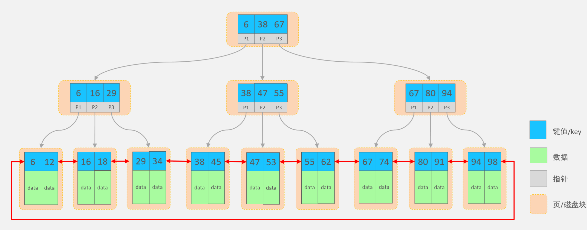

## SQL

### 通用语法

* SQL语句可以单行或多行书写，以分号结尾。
* SQL语句可以使用空格/缩进来增强语句的可读性。
* MySQL数据库的SQL语句不区分大小写。
* 注释：
  1. 单行注释：-- 注释内容 或 # 注释内容(MySQL特有)
  2. 多行注释： /* 注释内容 */

### 分类


分类 | 全称 | 说明
------- | ------- | -------
DDL | Data Definition Language | 数据定义语言，用来定义数据库对象(数据库，表，字段)
DML | Data Manipulation Language | 数据操作语言，用来对数据库表中的数据进行增删改
DQL | Data Query Language | 数据查询语言，用来查询数据库中表的记录
DCL | Data Control Language | 数据控制语言，用来创建数据库用户、控制数据库的访问权限


### DDL

#### 库操作

DDL 英文全称是 Data Definition Language，数据定义语言，用来定义数据库对象(数据库、表)。

* 查询所有数据库：`show databases;`
* 查询当前数据库：`select database();`
* 创建数据库：`create  database [ if  not  exists ]   数据库名 ;`
* 使用数据库：`use  数据库名 ;`
* 删除数据库：`drop  database [ if exists ]   数据库名;`

> 上述语法中的 `database`，也可以替换成 `schema`。如：`create schema  db01;`


#### 表操作

**创建**：
```sql
create table  表名(
	字段1  字段类型  [ 约束 ]  [ comment  字段1注释 ] ,
	......
	字段n  字段类型  [ 约束 ]  [ comment  字段n注释 ] 
) [ comment  表注释 ] ;

```

**约束**：

* 概念：约束是作用于表中字段上的规则，用于限制存储在表中的数据。
* 目的：保证数据库中数据的正确性、有效性和完整性。


约束 | 描述 | 关键字
------- | ------- | -------
非空约束 | 限制该字段值不能为null | `not null`
唯一约束 | 保证字段的所有数据都是唯一、不重复的 | `unique`
主键约束 | 主键是一行数据的唯一标识，要求非空且唯一 | `primary key`
默认约束 | 保存数据时，如果未指定该字段值，则采用默认值 | `default`
外键约束 | 让两张表的数据建立连接，保证数据的一致性和完整性 | `foreign key`


**数据类型**：

MySQL中的数据类型有很多，主要分为三类：数值类型、字符串类型、日期时间类型。

⬇️**数值类型**

类型 | 大小(byte) | 有符号(SIGNED)范围 | 无符号(UNSIGNED)范围 | 描述 | 备注
------- | ------- | ------- | ------- | ------- | -------
**tinyint** | 1 | (-128，127) | (0，255) | 小整数值 | 
smallint | 2 | (-32768，32767) | (0，65535) | 大整数值 | 
mediumint | 3 | (-8388608，8388607) | (0，16777215) | 大整数值 | 
**int** | 4 | (-2147483648，2147483647) | (0，4294967295) | 大整数值 | 
**bigint** | 8 | (-2^63 ，2^63 - 1) | (0，2^64 - 1) | 极大整数值 | 
float | 4 | (-3.402823466 E+38，3.402823466351 E+38) | 0 和 (1.175494351 E-38，3.402823466 E+38) | 单精度浮点数值 | float(5,2)：5表示整个数字长度，2 表示小数位个数
double | 8 | (-1.7976931348623157 E+308，1.7976931348623157 E+308) | 0 和 (2.2250738585072014 E-308，1.7976931348623157 E+308) | 双精度浮点数值 | double(5,2)：5表示整个数字长度，2 表示小数位个数
decimal |  |  |  | 小数值(精度更高) | decimal(5,2)：5表示整个数字长度，2 表示小数位个数


⬇️**字符串类型**
类型 | 大小 | 描述
------- | ------- | -------
**char** | 0-255 bytes | 定长字符串
**varchar** | 0-65535 bytes | 变长字符串
tinyblob | 0-255 bytes | 不超过255个字符的二进制数据
tinytext | 0-255 bytes | 短文本字符串
blob | 0-65 535 bytes | 二进制形式的长文本数据
text | 0-65 535 bytes | 长文本数据
mediumblob | 0-16 777 215 bytes | 二进制形式的中等长度文本数据
mediumtext | 0-16 777 215 bytes | 中等长度文本数据
longblob | 0-4 294 967 295 bytes | 二进制形式的极大文本数据
longtext | 0-4 294 967 295 bytes | 极大文本数据


⬇️**日期类型**

类型 | 大小(byte) | 范围 | 格式 | 描述
------- | ------- | ------- | ------- | -------
**date** | 3 | 1000-01-01 至 9999-12-31 | YYYY-MM-DD | 日期值
time | 3 | -838:59:59 至 838:59:59 | HH:MM:SS | 时间值或持续时间
year | 1 | 1901 至 2155 | YYYY | 年份值
**datetime** | 8 | 1000-01-01 00:00:00 至 9999-12-31 23:59:59 | YYYY-MM-DD HH:MM:SS | 混合日期和时间值
timestamp | 4 | 1970-01-01 00:00:01 至 2038-01-19 03:14:07 | YYYY-MM-DD HH:MM:SS | 混合日期和时间值，时间戳

## 事务

**事务** 是一组操作的集合，它是一个不可分割的工作单位。事务会把所有的操作作为一个整体一起向系统提交或撤销操作请求，即这些操作 **要么同时成功，要么同时失败**

> 默认MySQL的事务是自动提交的，也就是说，当执行一条DML语句，MySQL会立即隐式的提交事务

```sql
--开启事务（二选一）：
start transaction;  
begin;		

--提交事务：
commit;

--回滚事务：
rollback;
```

### 事务的四大特性

事务的四大特性也是关系型数据库的四大特性：

**ACID 特性** 
* 原子性（Atomicity）
* 一致性（Consistency）
* 隔离性（Isolation）
* 持久性（Durability）

ACID 是数据库事务管理的四大核心属性，确保数据可靠性： 
属性|中文|解释
---|---|---
A - Atomicity|原子性|操作要么全部执行，要么全部不执行（不允许部分成功）
C - Consistency|一致性|数据始终处于合法状态，事务完成后仍满足数据库规则
I - Isolation|隔离性|并发事务之间互不影响，避免读写冲突
D - Durability|持久性|一旦事务提交，数据永久写入，即使系统崩溃也不会丢失


## 索引

**索引（index）** 是帮助数据库 高效获取数据 的 **数据结构** 。

全表扫描效率很低

**优点：**
1. 提高数据查询的效率，降低数据库的IO成本。
2. 通过索引列对数据进行排序，降低数据排序的成本，降低CPU消耗。

**缺点：**
1. 索引会占用存储空间。
2. 索引大大提高了查询效率，同时却也降低了insert、update、delete的效率。


### 索引的数据结构

MySQL数据库支持的索引结构有很多，如：Hash索引、B+Tree索引、Full-Text索引等。我们平常所说的索引，如果没有特别指明，都是指默认的 **B+Tree** 结构组织的索引。

> 二叉搜索树/红黑树 大数据量情况下，层级深，检索速度慢


#### B+Tree(多路平衡搜索树)



**特点：**
* 每一个节点，可以存储多个key（有n个key，就有n个指针）
* 所有的数据都存储在叶子节点，非叶子节点仅用于索引数据
* 叶子节点形成了一颗双向链表，便于数据的排序及区间范围查询

```sql
--创建索引
create [ unique ] index 索引名 on 表名 (字段名,... );

--查看索引
show index from 表名;

--删除索引
drop index 索引名 on 表名;
```

创建索引会自动添加主键索引，唯一值的索引

* 主键字段，在建表时，会自动创建主键索引。
* 添加唯一约束时，数据库实际上会添加唯一索引。