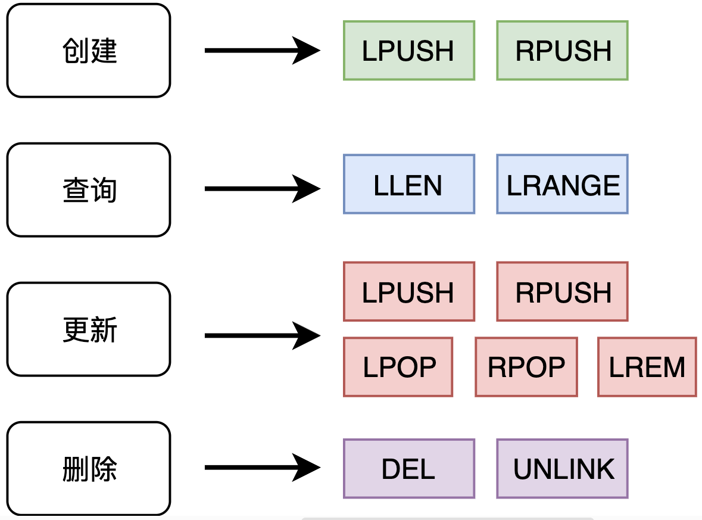
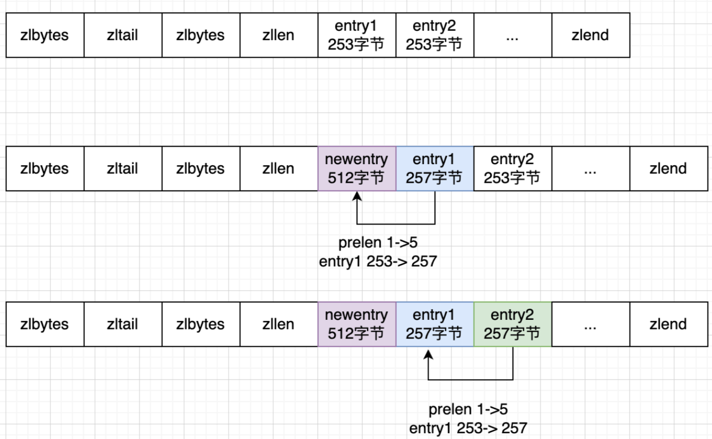

## 1. Redis入门概述

### 1.1. 是什么

Redis 是一个基于 `内存` 的，`key-value键值对` 的内存数据库
是一个开源（BSD许可）的，内存中的数据结构存储系统，它可以用作数据库，缓存和消息中间件。

### 1.2. 能干嘛

1. 分布式缓存，挡在mysql数据库之前的带刀护卫
2. 内存存储和持久化(RDB+AOF)
redis支持异步将内存中的数据写到硬盘上，同时不影响继续服务单机
3. 高可用架构搭配：单机、主丛、哨兵、集群
4. 缓存穿透、击穿、雪崩
5. 分布式锁
6. 队列
   Reids提供list和set操作，这使得Redis能作为一个很好的消息队列平台来使用。
我们常通过Reids的队列功能做购买限制。比如到节假日或者推广期间，进行一些活动，对用户购买行为进行限制，限制今天只能购买几次商品或者一段时间内只能购买一次。也比较适合适用。
1. 排行版+点赞......
    在互联网应用中，有各种各样的排行榜，如电商网站的月度销量排行榜、社交APP的礼物排行榜、小程序的投票排行榜等等。
    Redis提供的zset数据类型能够快速实现这些复杂的排行榜。比如小说网站对小说进行排名，根据排名，将排名靠前的小说推荐给用户

80%查询 + 20%写入

MySQL / Redis

1. 存储：硬盘 & 内存
2. 查询：MySQL是主键查询，Redis查询更快因为本身就是键值对
3. 关系的处理：RDBMS & NoSQL


与传统数据库关系(mysql)
Redis是key-value数据库(NoSQL一种)，mysql是关系数据库
Redis数据操作主要在内存，而mysql主要存储在磁盘
Redis在某一些场景使用中要明显优于mysql，比如计数器、排行榜等方面
Redis通常用于一些特定场景，需要与Mysql一起配合使用
两者并不是相互替换和竞争关系，而是共用和配管使用

### 1.3. 优势

性能极高－Redis能读的速度是110000次/秒，写的速度是81000次/秒
Redis数据类型丰富，不仅仅支持简单的key-value类型的数据，同时还提供list，set，zset，hash等数据结构的存储
Redis支持数据的持久化，可以将内存中的数据保持在磁盘中，重启的时候可以再次加载进行使用
Redis支持数据的备份，即master-slave模式的数据备份


### 1.4. 网站

https://redis.i0/
http://www.redis.cn/
https://www.redis.com.cn/documentation.html


[源码地址](https://github.com/redis/redis)
[Redis在线测试](https://try.redis.io/)
[Redis命令参考](http://doc.redisfans.com/)

### 1.5. 怎么玩

* 多种数据类型基本操作和配置
* 持久化和复制，FRDB/AOF
* 事务的控制
* 复制，集群等

### 1.6. Redis迭代演化和Redis7新特性浅谈

https://github.com/redis/redis/releases

历史发布版本的源码：https://download.redis.io/releases/

Redis Functions
Client-eviction
Multi-part AOF
ACL V2
新增命令
listpack替代ziplist
底层性能提升(和编码关系不大)


### 1.7. 安装

`redis-benchmark`:性能测试工具，服务启动后运行该命令，看看自己本子性能如何
`redis-check-aof`：修复有问题的AOF文件，rdb和aof后面讲
`redis-check-dump`:1修复有问题的dump.rdb文件
**`redis-cli`：客户端，操作入口**
redis-sentinel：redis集群使用
**`redis-server`：Redis服务器启动命令**

## 2. Redis 十大数据类型

这里说的数据类型是value的数据类型，key的类型都是字符串


1. redis字符串(String)
2. redis列表(List)
3. redis哈希表(Hash)
4. redis集合(Set)
5. redis有序集合(ZSet)
6. redis地理空间(GEO)
7. redis基数统计(HyperLogLog)
8. redis位图(bitmap)
9. redis位域(bitfield)
10. redis流(Stream)

**redis字符串(String)**

String（字符串）
string是redis最基本的类型，一个key对应一个value。
string类型是二进制安全的，意思是redis的string可以包含任何数据，比如jpg图片或者序列化的对象。
string类型是Redis最基本的数据类型，一个redis中字符串value最多可以是512M

**redis列表(List)**

List（列表）
Redis列表是简单的字符串列表，按照插入顺序排序。你可以添加一个元素到列表的头部（左边）或者尾部（右边）
它的底层实际是个双端链表，最多可以包含2^32－1个元素（4294967295，每个列表超过40亿个元素）

**redis哈希表(Hash)**

Redis hash 是一个 string 类型的 field（字段）和 value（值）的映射表，hash 特别适合用于存储对象。
Redis 中每个 hash 可以存储 2~32-1 键值对（40多亿）

**redis集合(Set)**

Redis 的 Set 是 String 类型的无序集合。集合成员是唯一的，这就意味着集合中不能出现重复的数据，集合对象的编码可以是 intset 或者hashtable.
Redis 中Set集合是通过哈希表实现的，所以添加，删除，查找的复杂度都是O(1)。
集合中最大的成员数为2^32－1（4294967295，每个集合可存储40多亿个成员）

 **redis有序集合(ZSet)**

`zset(sorted set：有序集合)`
Redis zset和set一样也是string类型元素的集合，且不允许重复的成员。
不同的是每个元素都会关联一个double类型的分数，redis正是通过分数来为集合中的成员进行从小到大的序。
zset的成员是唯一的,但分数(score)却可以重复。
zset集合是通过哈希表实现的，所以添加，删除，查找的复杂度都是0(1)。集合中最大的成员数为2^32－1

 **redis地理空间(GEO)**

 Redis GEO主要用于存储地理位置信息，并对存储的信息进行操作，包括
添加地理位置的坐标。
获取地理位置的坐标。
计算两个位置之间的距离。
根据用户给定的经纬度坐标来获取指定范围内的地理位置集合

 **redis基数统计(HyperLogLog)**

 HyperLogLog 是用来做基数统计的算法，HyperLogLog 的优点是，在输入元素的数量或者体积非常非常大时，计算基数所需的空间总是固定且是很小的。

在 Redis 里面，每个 HyperLogLog 键只需要花费 12 KB 内存，就可以计算接近 2^64 个不同元素的基 数。这和计算基数时，元素越多耗费内存就越多的集合形成鲜明对比。

但是，因为 HyperLogLog 只会根据输入元素来计算基数，而不会储存输入元素本身，所以 HyperLogLog 不能像集合那样，返回输入的各个元素。

**redis位图(bitmap)**


**redis位域(bitfield)**


通过bitfield命令可以一次性操作多个比特位域(指的是连续的多个比特位)，它会执行一系列操作并返回一个响应数组，这个数组中的元
素对应参数列表中的相应操作的执行结果。
说白了就是通过bitfield命令我们可以一次性对多个比特位域进行操作。


**redis流(Stream)**

Redis Stream 是 Redis 5.0 版本新增加的数据结构。

Redis Stream 主要用于消息队列（MQ，Message Queue），Redis 本身是有一个 Redis 发布订阅（pub/sub）来实现消息队列的功能，但它有个缺点就是消息无法持久化，如果出现网络断开、Redis 宕机等，消息就会被丢弃。

简单来说发布订阅（pub/sub）可以分发消息，但无法记录历史消息。

而 Redis Stream 提供了消息的持久化和主备复制功能，可以让任何客户端访问任何时刻的数据，并且能记住每一个客户端的访问位置，还能保证消息不丢失

### 2.1. Redis常用命令

官网英文：https://redis.io/commands/
常见数据类型操作命令中文：http://www.redis.cn/commands.html

column0 | column1
------- | -------
`keys *` | 查看当前库所有的key
`exists key` | 判断某个key是否存在
`type key` | 查看你的key是什么类型
`del key` |删除指定的key数据
`unlink key` | 非阻塞删除，仅仅将keys从keyspace元数据中删除，真正的删除会在后续异步中
`ttl key` |查看还有多少秒过期，-1表示永不过期，-2表示已过期
`expire key` | 秒钟为给定的key设置过期时间
`move key dbindex 【0-15】` | 将当前数据库的key移动到给定的数据库 db 当中
`select dbindex` | 切换数据库【0-15】，默认为0
`dbsize9` |查看当前数据库key的数量
`flushdb` |清空当前库
`flushall` | 通杀全部库

**命令不区分大小写，而key是区分大小写的**

永远的帮助命令，`help @类型`
`help @string`
`help @list`
`help @hash`
`help @hyperloglog` ......


### 2.2. Redis String

https://redis.io/docs/data-types/strings/

#### 2.2.1. 命令

**最常用**

**set key value**

`set key value [NX|XX] [GET] [EX seconds|PX milliseconds|EXAT unix-time-seconds|PXAT unix-time-milliseconds|KEEPTTL]`
`SET` 命令有 `EX`、`PX`、`NX`、`XX` 以及 `KEEPTTL` 五个可选参数
其中 `KEEPTTL` 为6.O版本添加的可选参数，其它为2.6.12版本添加的可选参数

参数|含义
-------|----
`EX seconds` |以秒为单位设置过期时间
`PX milliseconds` | 以毫秒为单位设置过期时间
`EXAT timestamp` | 设置以秒为单位的UNIX时间戳所对应的时间为过期时间
`PXAT milliseconds-timestamp` |设置以毫秒为单位的UNIx时间戳所对应的时间为过期时间
`NX` |键不存在的时候设置键值
`XX` |键存在的时候设置键值
`KEEPTTL` | 保留设置前指定键的生存时间
`GET` |返回指定键原本的值，若键不存在时返回ni1


`SET` 命令使用 `EX`、`PX`、`NX` 参数，其效果等同于 `SETEX`、`PSETEX`、`SETNX` 命令。
根据官方文档的描述，未来版本中 `SETEX`、`PSETEX`、`SETNX` 命令可能会被淘汰。
`EXAT`、`PXAT` 以及 `GET` 为Redis6.2新增的可选参数。

**get key value**


**同时设置/获取多个键值**

MSET key value [key value ....]
MGET key [key ....]
mset/mget/msetnx


**获取指定区间范围内的值**

`getrange` / `setrange`


**数值增减**

**一定要是数字才能进行加减**
递增数字 `INCR key`
增加指定的整数 `INCRBY key increment`
递减数值 `DECR key`
减少指定的整数 `DECRBY key decrement`


**获取字符串长度和内容追加**

STRLEN key
APPEND key value


**分布式锁**

setnx key value
setex(set with expire)键秒值 / setnx(set if not exist)


**getset（先get再set）**

getset:将给定key 的值设为 value，并返回 key 的l旧值(old value)。
简单一句话，先get然后立即set


#### 2.2.2. 底层实现


INT编码：这个很好理解，就是存一个整型，可以用long表示的整数就以这种编码存储；
EMBSTR编码：如果字符串小于等于阈值字节，使用EMBSTR编码；
RAW编码：字符串大于阈值字节，则用RAW编码。

这个阈值追溯源码的话，是用常量OBJ_ENCODING_EMBSTR_SIZE_LIMIT来表示，3.2版本之前是39字节，3.2版之后是44字节。

**EMBSTR** 和 **RAW** 都是由redisObject和SDS两个结构组成，它们的差异在于，EMBSTR下redisObject和SDS是连续的内存，RAW编码下redisObject和SDS的内存是分开的。

EMBSTR优点是redisObject和SDS两个结构可以一次性分配空间，缺点在于如果重新分配空间，整体都需要再分配，所以EMBSTR设计为只读，任何写操作之后EMBSTR都会变成RAW，理念是发生过修改的字符串通常会认为是易变的。

EMBSTR


RAW


**编码转换**
随着操作进行，编码可能转换：
- **INT -> RAW**：当存储内容不再是整数，或大小超过`long`范围时； 
- **EMBSTR->RAW**：任何写操作后，EMBSTR 会变为 RAW ，原因前文有解释 。 

我们注意到，字符串编码 EMBSTR 和 RAW 都包含 **SDS**（Simple Dynamic String ，简单动态字符串）结构，它是 Redis 内部作为基石的字符串封装，十分重要，下面详细介绍。 

**为什么需要 SDS ？**
在 C 语言中，字符串用`\0`结尾的`char`数组表示，如`"hello niumiu"`即`"hello niumiu\0"` 。  

C 语言作为较亲和底层的语言，基础实现简单，但对部分应用场景不友好：  
1. 每次计算字符串长度复杂度为`O(N)`；  
2. 对字符串追加，需重新分配内存；  
3. 非二进制安全 。  

在 Redis 内部，字符串追加和长度计算很常见，不应成为性能瓶颈，于是封装 SDS 字符串结构解决上述问题，来看其结构。  

Redis 中 SDS 分为 `sdshdr8`、`sdshdr16`、`sdshdr32`、`sdshdr64` ，字段属性相同，区别在于应对不同大小字符串，以 `sdshdr8` 为例：  
```c
// from Redis 7.0.8
struct __attribute__ ((__packed__)) sdshdr8 {
    uint8_t len; /* used */
    uint8_t alloc; /* excluding the header and null terminator */
    unsigned char flags; /* 3 Lsb of type, 5 unused bits */
    char buf[];
};
```  
关键字段：`len`表示已使用长度；`alloc`表示总共分配内存，`alloc - len`是预留空间大小；`flags`标记分类（如 `sdshdr8` 分类：`#define SDS_TYPE_8 1`  ）。  

**SDS 如何解决问题**

从结构可看出 SDS 解决问题的思路：  
1. 用`len`字段，快速返回字符串长度（无需遍历）；  
2. 用`alloc - len`的空余空间，为后续追加数据留余地，减少内存重分配次数；  
3. 不以`\0`作判断标准，实现二进制安全（可存储任意二进制数据 ）。  

**SDS 预留空间规则**
- `len`小于 1M 时，`alloc = 2 * len`，预留`len`大小空间；  
- `len`大于 1M 时，`alloc = 1M + len`，预留 1M 大小空间；  
简单说，预留空间为`min(len, 1M)` 。  


#### 2.2.3. 应用场景
比如抖音无限点赞某个视频或者商品，点一下加一次


是否喜欢的文章
阅读数：只要点击了rest地址，直接可以使用incrkey 命令增加一个数字1，完成记录数字。


### 2.3. Redis List

**单key多value**

**简单说明**

一个双端链表的结构，**双端操作对象**，容量是 **2的32次方减1个元素**，大概40多亿，主要功能有push/pop等，一般用在栈、队列、消息队列等场景。

left、right都可以插入添加；
* 如果键不存在，创建新的链表；
* 如果键已存在，新增内容；
* 如果值全移除，对应的键也就消失了。

它的底层实际是个双向链表，对两端的操作性能很高，通过索引下标的操作中间的节点性能会较差。

**案例**
命令| 含义
-------| -------
`lpush`/`rpush`/`lrange`| 
`lpop`/`rpop` | 
`lindex` | 按照索引下标获得元素（从上到下）
`llen` | 获取列表中元素的个数
`lrem key` | 数字N给定值v1解释（删除N个值等于v1的元素）
`ltrim key` | 开始index 结束index，截取指定范围的值后再赋值给key
`rpoplpush` | 源列表 目的列表
`lset key index value `
`linsert key before/after` | 已有值插入的新值



**应用场景**

1 大V作者李永乐老师和CSDN发布了文章分别是 11 和 22
2 阳哥关注了他们两个，只要他们发布了新文章，就会安装进我的List
Ipush likearticle:阳哥id11 22
3 查看阳哥自己的号订阅的全部文章，类似分页，下面0~10就是一次显示10条
Irange likearticle:阳哥id 0 9

#### 2.3.1. 底层实现

**编码方式**
3.2 版本之前，List 对象有两种编码方式，一种是 `ZIPLIST`，另一种是 `LINKEDLIST` 。


当满足如下条件时，用 `ZIPLIST` 编码：
1. 列表对象保存的所有字符串对象长度都小于 64 字节； 
2. 列表对象元素个数少于 512 个，注意，这是 LIST 的限制，而不是 ZIPLIST 的限制； 

`ZIPLIST` 底层用压缩列表实现，这里我们假设列表中包含 `"hello"`、`"niumiu"`、`"mart"` 三个元素，`ZIPLIST` 编码示意如下：


可以看到，`"hello"`、`"niumiu"`、`"mart"` 都挨在一起，正如其名字一样，`ZIPLIST` 内存排列得很紧凑，可以有效节约内存空间。 

其它几个数据字段我们这里可以先不关心，下一节会详细讲解 `ZIPLIST` 的结构，目前我们只需要能宏观理解压缩列表的数据是紧凑相连的即可。 

如果不满足 `ZIPLIST` 编码的条件，则使用 `LINKEDLIST` 编码。为了便于描述，我们还是假设列表中包含 `"hello"`、`"niumiu"`、`"mart"` 三个元素，如果用 `LINKEDLIST` 编码，则是几个 String 对象的链接结构，结构示意图如下：


可以看到，`"hello"`、`"niumiu"`、`"mart"` 这几个数据是以链表的形式连接在一起，实际上删除更为灵活，但是内存不如 `ZIPLIST` 紧凑，所以只有在列表个数或节点数据长度比较大的时候，才会使用 `LINKEDLIST` 编码，以加快处理性能，一定程度上牺牲了内存。 

**QUICKLIST 横空出世**
上面的分析有说到，`ZIPLIST` 是为了在数据较少时节约内存，`LINKEDLIST` 是为了数据多时提高更新效率，`ZIPLIST` 数据稍多时插入数据会导致很多内存复制。  

但如果节点非常多的情况，`LINKEDLIST` 链表的节点就很多，会占用不少的内存。这种情况有没有办法优化呢？  

3.2 版本就引入了 `QUICKLIST`。`QUICKLIST` 其实就是 `ZIPLIST` 和 `LINKEDLIST` 的结合体。  


`LINKEDLIST` 原来是单个节点，只能存一个数据，现在单个节点存的是一个 `ZIPLIST`，即多个数据。  


这种方案其实是用 `ZIPLIST`、`LINKEDLIST` 综合的结构，取代二者本身。  

当数据较少的时候，`QUICKLIST` 的节点就只有一个，此时其实相当于就是一个 `ZIPLIST`；  
当数据很多的时候，则同时利用了 `ZIPLIST` 和 `LINKEDLIST` 的优势。  

**ZIPLIST 优化**
`ZIPLIST` 本身存在一个连锁更新的问题，所以 Redis 7.0 之后，使用了 `LISTPACK` 的编码模式取代了 `ZIPLIST`，而它们其实本质都是一种压缩的列表，所以其实可以统一叫做压缩列表。  

`ZIPLIST` 的细节，以及 `LISTPACK` 是怎么优化的，我们将在下一节介绍。

#### 2.3.2. 底层数据结构压缩列表
##### 2.3.2.1. 压缩列表是什么？
上一节其实已经提过，压缩列表，顾名思义，就是排列紧凑的列表。  

压缩列表在 Redis 中有两种编码方式，一种是 `ZIPLIST`，平常说的压缩列表其实一般就是指 `ZIPLIST`，一种是 `LISTPACK`，`LISTPACK` 是在 Redis 5.0 引入，直到 Redis 7.0 完全替换了 `ZIPLIST`，可以说是 `ZIPLIST` 的进阶版本。  

##### 2.3.2.2. 压缩列表解决什么问题？
上一节讲解 List 的时候，我们有说到压缩列表是 List 的底层数据结构，压缩列表主要用做底层数据结构提供紧凑型的数据存储方式，能节约内存（节省链表指针的开销），小数据量的时候遍历访问性能好（连续+缓存命中率友好）。  

##### 2.3.2.3. ZIPLIST 整体结构
我们先看一下 `ZIPLIST`，虽然已经有 `LISTPACK`，但实际面试中聊得比较多的，还是 `ZIPLIST`。  

Redis 代码注释中，非常清晰描述了 `ZIPLIST` 的结构：  
```
* The general layout of the ziplist is as follows:
*
* <zlbytes> <zltail> <zllen> <entry> <entry> ... <entry> <zlend>
```  

比如这就是有 3 个节点的 `ziplist` 结构：  

 

各字段的含义：  
- `zlbytes`：表示该 `ZIPLIST` 一共占了多少字节数，这个数字是包含 `zlbytes` 本身占据的字节的。  
- `zltail`：`ZIPLIST` 尾巴节点相对于 `ZIPLIST` 的开头（起始指针），偏移的字节数。通过这个字段可以快速定位到尾部节点，例如现在有一个 `ZIPLIST`，`zl` 指向它的开头，如果要获取 `tail` 尾巴节点，即 `ZIPLIST` 里的最后一个节点，可以以 `zl + zltail` 的值，这样定位到它。如果没有尾节点，就定位到 `zlend`。  
- `zllen`：表示有多少个数据节点，在本例中就有 3 个节点。  
- `entry1~entry3`：表示压缩列表数据节点。  
- `zlend`：一个特殊的 `entry` 节点，表示 `ZIPLIST` 的结束。  


#### 2.3.3. ZIPLIST 节点结构
`ZIPLIST ENTRIES` 定义如下：  
```
<prevlen> <encoding> <entry-data>
```  

各字段的含义：  
- `prevlen`：表示上一个节点的数据长度。通过这个字段可以定位上一个节点的起始地址（或者说开头），也就是 `p - prevlen` 可以跳到前一个节点的开头位置，实现从后往前操作，所以压缩列表才可以从后往前遍历。  
  - 如果前一个节点的长度，也就是前一个 `ENTRY` 的大小，小于 254 字节，那么 `prevlen` 属性需要用 1 字节长的空间来保存这个长度值，255 是特殊字符，被 `zlend` 使用了。  
  - 如果前一节点的长度大于等于 254 字节，那么 `prevlen` 属性需要用 5 字节长的空间来保存这个长度值，注意 5 个字节中的第一个字节为 `11111110`，也就是 254，标志这是个 5 字节的 `prevlen` 信息，剩下 4 字节来表示大小。  
- `encoding`：编码类型。编码类型里还包含了一个 `entry` 的长度信息，可用于正向遍历。  
- `entry-data`：实际的数据。  


##### 2.3.3.1. encoding 编码规则
`encoding` 用于设定整型数据，其二进制编码由内容数据的类型和内容数据的字节长度两部分组成，根据内容类型有如下几种情况：  

| 编码 | 大小 | 类型 |
| ---- | ---- | ---- |
| `00pppppp` | 1 字节 | String 类型，且字符串长度小于 `2^6`，即小于等于 63 |
| `01pppppp\|qqqqqqqq` | 2 字节 | String 类型，长度小于 `2^14` 次方，即小于等于 16383 |
| `10000000\|qqqqqqqq\|rrrrrrrr\|ssssssss\|tttttttt` | 5 字节 | String 类型，长度小于 `2^32` 次方 |
| `11000000` | 1 字节 | 2 个字节的 int16 类型 |
| `11010000` | 1 字节 | 4 个字节的 int32 类型 |
| `11100000` | 1 字节 | 8 个字节的 int64 类型 |
| `11110000` | 1 字节 | 24 位有符号整数 |
| `11111110` | 1 字节 | 8 位有符号整数 |
| `1111xxxx` | 1 字节 | `xxxx` 从 1 到 13 一共 13 个值，这时就用这 13 个值来表示真正的数据。注意，这里是表示真正的数据，而不是数据长度了，这种情况 `<entry-data>` 就没有了 |  

注意，如果是 String 类型，那么 `encoding` 有两部分，一般是前几位标识类型、后几位标识长度。但如果是 int 类型，整体 1 字节编码，就只是标识了类型，因为 int 的具体类型就自带了大小，比如 int32，就是 32 位，4 字节的大小，不需要 `encoding` 特别标识。  

`encoding` 的编码规则比较复杂，我们其实只需要理解它的核心思想，面试中能讲清楚怎么区分不同类型即可，不用去背它的这些具体编码，这个很难记住，也没有必要去记。  


#### 2.3.4. ZIPLIST 查询数据
聚焦看两个关键的查询操作，来理解 `ZIPLIST` 是如何运作的。  

##### 2.3.4.1. 查询 ZIPLIST 的数据总量  
由于 `ZIPLIST` 的 `header` 定义了记录节点数量的字段 `zllen`，所以通常是可以在 `O(1)` 时间复杂度直接返回的，说“通常”是因为 `zllen` 是 2 个字节的，当 `zllen` 大于 65535 时，`zllen` 就存不下了，所以真实的节点数量需要遍历来得 到。  

这样设计的原因是 Redis 中应用 `ZIPLIST` 都是为了节点个数少的场景，所以将 `zllen` 设计得较小，节约内存空间。  

##### 2.3.4.2. 在 ZIPLIST 中查询指定数据的节点  
在 `ZIPLIST` 中查询指定数据的节点，需要遍历这个压缩列表，平均时间复杂度是 `O(N)`。  


#### 2.3.5. ZIPLIST 更新数据  
`ZIPLIST` 的更新就是增加、删除数据，`ZIPLIST` 提供头尾增减的能力，但是操作平均时间复杂度是 `O(N)`，因为在头部增加一个节点会导致后面节点都往后移动，所以更新的平均时间复杂度，可以看作 `O(N)`。  

其中要注意的是更新操作可能带来连锁更新。注意上面所说的增加节点导致后移，不是连锁更新。连锁更新是指这个后移，发生了不止一次，而是多次。  

比如增加一个头部新节点，后面依赖它的节点，需要 `prevlen` 字段记录它的大小，原本只用 1 字节记录，因为更新可能膨胀为 5 字节，然后这个 `entry` 的大小也就膨胀了。所以，当这个新数据插入导致的后移完成之后，还需要逐步迭代更新。这种现象就是连锁更新，时间复杂度是 `O(N^2)`，6.2 已经优化为 `O(N)`，文档见当前目录的子文档（内容 update 2023-06-07 ）  

大家可能会比较担心连锁更新带来的性能问题，但在实际的业务中，很少会刚好遇到需要迭代更新超过 2 个节点的情况，所以 `ZIPLIST` 更新平均时间复杂度，还是可以看作 `O(N)`。不过，`ZIPLIST` 最大的问题还是连锁更新导致性能不稳定。  




#### 2.3.6. LISTPACK 优化  
##### 2.3.6.1. 连锁更新原因分析  
`LISTPACK` 是为了解决 `ZIPLIST` 最大的痛点——连锁更新，我们先来看，`ZIPLIST` 的问题本源。  

我们知道，`ZIPLIST` 需要支持 LIST，LIST 是一种双端访问结构，所以需要能从后往前遍历，上面有讲，`ZIPLIST` 的数据节点的结构是这样的：  
```
<prevlen> <encoding> <entry-data>
```  

其中，`prevlen` 就表示上一个节点的数据长度，通过这个字段可以定位上一个节点的数据，可以说，连锁更新问题，就是因为 `prevlen` 导致的。  

##### 2.3.6.2. 对症下药  
我们需要一种不记录 `prevlen`，并且还能找到上一个节点的起始位置的办法，Redis 使用了很巧妙的一种方式。  

直接看 `LISTPACK` 的节点定义：  
```
<encoding-type><element-data><element-tot-len>
```  

- `encoding-type` 是编码类型，`element-data` 是数据内容，`element-tot-len` 存储整个节点除它自身之外的长度。  

找到上一个节点的秘密就藏在 `element-tot-len`：  

`element-tot-len` 所占用的每个字节的第一个 bit 用于标识是否结束，0 是结束，1 是继续，剩下 7 个 bit 来存储数据大小。当我们需要找到当前元素的上一个元素时，我们可以从后向前依次查找每个字节，找到上一个 `Entry` 的 `element-tot-len` 字段的结束标识，就可以算出上一个节点的首位置了。  

举个例子：  

如果上个节点的 `element-tot-len` 为 `00000001 10000100`，每个字节第一个 bit 标志是否结束，所以这里的 `element-tot-len` 一共就两个字节，大小为 `00000001 0000100`，即 132 字节。  


### 2.4. Redis Set

#### 2.4.1. 是什么？  
Redis 的 Set 是一个不重复、无序的字符串集合，这里额外说明一下，如果是 INTSET 编码的时候其实是有序的，不过一般不应该依赖这个，整体还是看成无序来用比较好。  


#### 2.4.2. 适用场景  
适用于无序集合场景，比如某个用户关注了哪些公众号，这些信息就可以放进一个集合，Set 还提供了查交集、并集的功能，可以很方便地实现共同关注的能力。  


#### 2.4.3. 常用操作
我们还是从创建、查询、更新、删除这几个基本操作来了解 Set。  

- **创建**：产生一个 Set 对象，可以使用 `SADD` 创建。  
- **查询**：非常丰富，`SISMEMBER` 可以查询元素是否存在；`SCARD`、`SMEMBERS`、`SSCAN` 可以查询集合元素数据；`SINTER`、`SUNION`、`SDIFF` 可以对多个集合查交集、并集和差异。  
- **更新**：可以使用 `SADD` 增加元素，`SREM` 删除元素。  
- **删除**：和其它对象一样，`DEL` 可以删除一个 Set 对象。


### 2.5. Redis Hash

#### 2.5.1. 是什么？  
Redis Hash 是一个 `field`、`value` 都为 `string` 的哈希表，存储在 Redis 的内存中。  

Redis 中每个 hash 可以存储 `2^(32)-1` 键值对（40 多亿）。  


#### 2.5.2. 适用场景  
适用于 `O(1)` 时间字典查找某个 `field` 对应数据的场景，比如任务信息的配置，就可以任任务类型为 `field`，任务配置参数为 `value`。  


#### 2.5.3. 常用操作  
我们还是从创建、查询、更新、删除这几个基本操作来了解 hash。  

- **创建**：即产生一个 Hash 对象，可以使用 `HSET`、`HSETNX` 创建。  
- **查询**：支持 `HGET` 查询单个元素；`HGETALL` 查询所有数据；`HLEN` 查询数据总数；`HSCAN` 进行游标迭代查询。  
- **更新**：`HSET` 可以用于增加新元素，`HDEL` 删除元素。  
- **删除**：和其它对象一样，`DEL` 可以删除一个 Hash 对象。  

【图片：展示创建（关联 HSET、HSETNX ）、查询（关联 HGETALL、HGET、HLEN、HSCAN ）、更新（关联 HSET、HSETNX、HDEL ）、删除（关联 DEL ）操作对应关系的示意图】

#### 2.5.4. 底层实现

Hash 底层有两种编码结构，一个是压缩列表，一个是 `HASHTABLE` 。同时满足以下两个条件，用压缩列表：  
1. Hash 对象保存的所有值和键的长度都小于 64 字节；  
2. Hash 对象元素个数少于 512 个。  

两个条件任何一条不满足，编码结构就用 `HASHTABLE` 。  

 


`ZIPLIST` 之前有讲解过，其实就是在数据量较小时的紧凑型连续排列，对应到 Hash，就是将 `field-value` 当作 `entry` 放入 `ZIPLIST`，结构如下：  

  


`HASHTABLE` 在之前无序集合 Set 中也有应用，和 Set 的区别在于，在 Set 中 `value` 始终为 `NULL`，但是在 Hash 中，是有对应的值的。  


## 3. Redis 持久化

官网地址 https://redis.io/docs/manual/persistence/

**为什么需要持久化**

持久化就是把内存中的数据写入磁盘，永久化保存，如果崩溃了，重启数据还能恢复

### RDB & AOF

#### RDB
**是什么**
RDB(Redis Database)：Redis 数据库快照，以指定的时间间隔执行数据集的时间点快照

实现类似照片记录效果的方式，就是把某一时刻的数据和状态以文件的形式写到磁盘上，也就是
快照。这样一来即使故障宕机，快照文件也不会丢失，数据的可靠性也就得到了保证。
这个快照文件就称为RDB文件(dump.rdb)，其中，RDB就是Redis DataBase的缩写。

**能干嘛**
在指定的时间间隔内将内存中的数据集快照写入磁盘，也就是行话讲的Snapshot内存快照，它恢复时再将硬盘快照文件直接读回到内存里

Redis的数据都在内存中，保存备份时它执行的是全量快照，也就是说，把内存中的所有数据都记录到磁盘中，“一锅端”

Rdb保存的是dump.rdb文件


**实操**

配置文件：6和7不同

操作步骤：

##### 自动触发

Redis7版本，按照redis.conf里配置的save<seconds><changes>
本次案例5秒2次修改I
修改dump文件保存路径
修改dump文件名称
**触发备份**
1. 第一种情况
2. 第二种情况

**如何恢复**
* 将备份文件（dump.rdb）移动到redis 安装目录并启动服务即可
* 备份成功后故意用flushdb清空redis，看看是否可以恢复数据
* 物理恢复，一定服务和备份 **分机隔离**（不然会被覆盖）
* （执行flushall/flushdb命令也会产生dump.rdb文件，但里面是空的，无意义） 

##### 手动触发

`save` & `bgsave`

`save`

* 在主程序中执行会 **阻塞** 当前redis服务器，直到持久化工作完成执行save命令期间，Redis不能处理其他命令，**线上禁止使用**

`bgsave`

* Redis会在后台暴步进行快照操作，**不阻塞** 快照同时还可以响应客户端请求,该触发方式会fork一个子进程由子进程复制持久化过程

* Redis会使用bgsave对当前内存中的所有数据做快照，这个操作是子进程在后台完成的，这就允许主进程同时可以修改数据。

> fork是什么：在Linux程序中，fork()会产生一个和父进程完全相同的子进程，但子进程在此后多会exec系统调用，出于效率考虑，尽量避免膨胀。

##### 优缺点

**优点：**
* 适合大规模的数据恢复
* 按照业务定时备份
* 对数据完整性和一致性要求不高
* RDB文件在内存中的加载速度要比 AOF快得多

**缺点：**
* 在一定间隔时间做一次备份，所以如果redis意外down掉的话，就会丢失从当前至最近一次快照期间的数据，快照之间的数据会丢失
* 内存数据的全量同步，如果数据量太大会导致1/0严重影响服务器性能
* RDB依赖于主进程的fork，在更大的数据集中，这可能会导致服务请求的瞬间延迟。fork的时候内存中的数据被克隆了一份，大致2倍的膨胀性，需要考虑


##### 检查修复dump文件


##### 哪些情况会触发RDB

* 配置文件中默认的快照配置
* 手动save/bgsave命令
* 执行flushall/flushdb命令也会产生dump.rdb文件，但里面是空白的，无意义
* 执行shutdown且没有设置开启AOF持久化
* 主从复制时，主节点自动触发


##### 如何禁用RDB

1. 动态所有停止RDB保存规则的方法：redis-cli config set save
2. 快照禁用

##### RDB优化配置

配置文件SNAPSHOTTING模块

`save <seconds> <changes>`
`dbfilename`
`dir`

`stop-writes-on-bgsave-error` 
* 默认yes
* 如果配置成no，表示你不在乎数据不一致或者有其他的手段发现和控制这种不一致，那么在快照写入失败时，也能确保redis继续接受新的写请求

`rdbcompression`
* 默认yes
* 对于存储到磁盘中的快照，可以设置是否进行压缩存储。如果是的话，redis会采用LZF算法进行压缩。
* 如果你不想消耗CPU来进行压缩的话，可以设置为关闭此功能

`rdbchecksum`
* 默认yes
* 在存储快照后，还可以让redis使用CRC64算法来进行数据校验，但是这样做会增加大约10%的性能消耗，如果希望获取到最大的性能提升，可以关闭此功能

`rdb-del-sync-files`
* 在没有持久性的情况下删除复制中使用的RDB文件启用。默认情况下no，此选项是禁用的。

#### AOF
AOF(Append Only File)：就是把每次操作都记录到磁盘，如果崩溃了，重启数据还能恢复


**是什么**
* 以日志的形式来记录每个写操作，将Redis执行过的所有写指令记录下来(读操作不记录)，只许追加文件但不可以改写文件，redis启动之初会读取该文件重新构建数据，换言之，redis重启的话就根据日志文件的内容将写指令从前到后执行一次以完成数据的恢复工作
* 默认情况下，redis是没有开启AOF(append only file)的，开启AoF功能需要设置配置：`appendonly yes`

Aof保存的是 `appendonly.aof` 文件

##### AOF持久化工作流程


1. Client作为命令的来源，会有多个源头以及源源不断的请求命令。
2. 在这些命令到达RedisSerVer以后并不是直接写入AOF文件，会将其这些命令先放入AOF缓存中进行保存。这里的AOF缓冲区实际上是内存中的一片区域，存在的目的是当这些命令达到一定量以后再写入磁盘，避免频繁的磁盘I0操作。
3. AOF缓冲会根据AOF缓冲区 **同步文件的三种写回策略** 将命令写入磁盘上的AOF文件。
4. 随着写入AOF内容的增加为避免文件膨胀，，会根据规则进行命令的合并（又称 **AOF重写**），从而起到AOF文件压缩的目的。
5. 当RedisServer服务器重启的时候会从AOF文件载入数据。

##### AOF缓冲区三种写回策略

`always` & `everysec`（默认） & `no`

* `always`：同步写回，每个写命令执行完立刻同步地将日志写回磁盘
* `everysec`：每秒写回，每个写命令执行完，只是先把日志写到AOF文件的内存缓冲区，每隔1秒把缓冲区中的内容写入磁盘
* `no`：操作系统控制的写回，每个写命令执行完，只是先把日志写到AOF文件的内存缓冲区，由操作系统决定何时将缓冲区内容写回磁盘


##### 案例演示和说明（AOF配置/启动/修复/恢复）


##### 优缺点


##### AOF重写机制


##### AOF优化配置项


