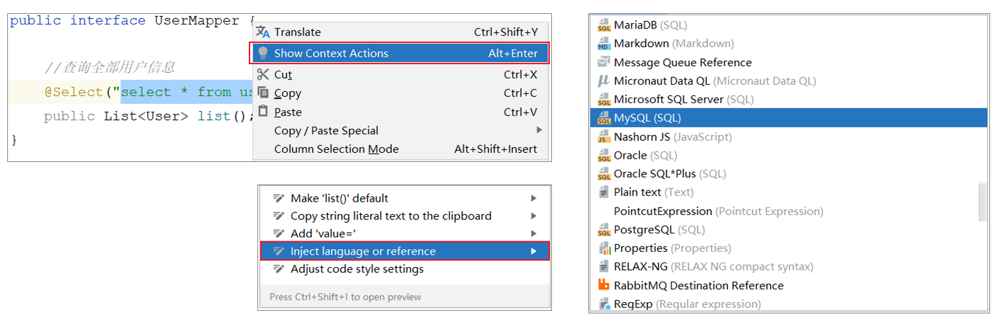
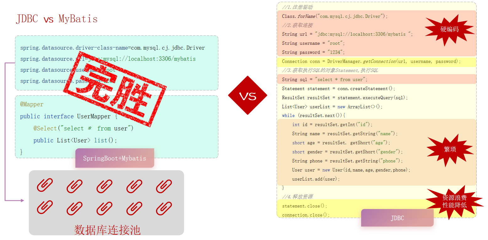

## MyBatis

MyBatis是一款优秀的 持久层（DAO层） 框架，用于简化JDBC的开发

### 入门使用步骤

1. 准备工作(创建springboot工程、数据库表user、实体类User)
   - 创建时要添加依赖
   - 
2. 配置MyBatis（四要素）
   ```
   spring.datasource.driver-class-name=com.mysql.cj.jdbc.Driver //驱动
   spring.datasource.url=jdbc:mysql://localhost:3306/mybatis    //连接地址（数据库url）
   spring.datasource.username=root                              //用户名
   spring.datasource.password=123456                            //密码
   ```
3. 编写SQL语句（注解、XML）
    ```java
    @Mapper  // 在运行时，会自动的生成该接口的实现类对象（代理对象），并且将该对象交给IOC容器管理
    public interface UserMapper {
        @Select("select *  from user")
        public List<User> list();
    }
    // 单元测试时要通过 @Autowired 注入
    ```


> 可以在IDEA中配置SQL语句的识别
> 

### JDBC介绍

JDBC： ( Java DataBase Connectivity )，就是使用Java语言操作关系型数据库的一套API。

* sun公司官方定义的一套操作所有关系型数据库的规范，即接口。
* 各个数据库厂商去实现这套接口，提供数据库驱动jar包。
* 我们可以使用这套接口（JDBC）编程，真正执行的代码是驱动jar包中的实现类。


**JDBC的缺点：**

* 硬编码：URL、用户名、密码、字段名都写在代码里，可维护性差

* 模板代码多：注册驱动、创建 Statement、遍历 ResultSet、手动映射，重复且易出错

* 资源管理繁琐：必须显式关闭各种对象，不当释放易造成连接泄漏

* 性能开销大：无连接池管理，频繁建立/关闭连接

**MyBatis优势：**

* 极简代码：只有接口 + 注解/XML，几行就能完成查询

* 无硬编码：SQL 可以集中管理、动态拼装，更灵活

* 自动映射：ResultMap/注解自动将列映射到对象字段

* 连接池管理：由 Spring + DBCP/HikariCP 等统一管理，性能更优

* 可维护性高：SQL 与 Java 代码分离，团队协作效率提升



### 数据库连接池

**数据库连接池** 是个 **容器**，负责分配、管理数据库连接(Connection)
它允许应用程序重复使用一个现有的数据库连接，而不是再重新建立一个
释放空闲时间超过最大空闲时间的连接，来避免因为没有释放连接而引起的数据库连接遗漏

**优势：**
* 资源重用
* 提升系统响应速度
* 避免数据库连接遗漏

**标准接口**：DataSource

官方(sun)提供的数据库连接池接口，由第三方组织实现此接口。

**功能：**获取连接 `Connection getConnection() throws SQLException;`
**常见产品：**
* Druid（德鲁伊）
* Hikari（Springbooot默认）


### lombok

Lombok是一个实用的Java类库，能通过注解的形式自动生成构造器、getter/setter、equals、hashcode、toString等方法，并可以自动化生成日志变量，简化java开发、提高效率。

注解 |  作用
------- | ------- 
`@Getter` / `@Setter` | 为所有的属性提供get/set方法
`@ToString` | 会给类自动生成易阅读的 toString 方法
`@EqualsAndHashCode` | 根据类所拥有的非静态字段自动重写 equals 方法和 hashCode 方法
`@Data` | 提供了更综合的生成代码功能（@Getter + @Setter + @ToString + @EqualsAndHashCode）
`@NoArgsConstructor` | 为实体类生成无参的构造器方法
`@AllArgsConstructor` | 为实体类生成除了static修饰的字段之外带有各参数的构造器方法。


> Lombok会在编译时，自动生成对应的java代码。我们使用lombok时，还需要安装一个lombok的插件(idea自带)。


## Mybatis基础操作

Mybatis配置sql语句有两种方式
1. 添加注解
2. 使用xml映射文件

### 日志信息配置

配置mybatis的日志，指定输出到控制台

```properties
#指定mybatis输出日志的位置,输出控制台
mybatis.configuration.log-impl=org.apache.ibatis.logging.stdout.StdOutImpl
```

#### 预编译SQL

```sql
--前两行是预编译SQL
==>  Preparing: delete from emp where id = ? --？是预编译SQL的参数占位符
==> Parameters: 16(Integer)
<==    Updates: 1
```

预编译SQL的 **优势**：
- 性能更高
- 更安全（防止SQL注入攻击）

> **SQL注入** 是通过操作输入的数据来修改事先定义好的SQL语句，以达到执行代码对服务器进行攻击的方法

在MyBatis中，预编译占位符的形式就是 `#{参数名}`

`${参数名}`是直接拼接，**不是**预编译SQL

`#{参数名}` | `${参数名}`
---|---
执行SQL时，会将 `#{…}` 替换为 `?` ，生成预编译SQL，会自动设置参数值。|拼接SQL。直接将参数拼接在SQL语句中，存在SQL注入问题。
使用时机：参数传递，都使用 `#{…}`|使用时机：如果对表名、列表进行动态设置时使用。

### 注解

#### 删除

```java
@Delete("delete from emp where id = #{id}")
public void delete(Integer id);
```

如果返回值类型是int，则返回受影响的行数，失败返回0

如果mapper接口方法形参只有一个普通类型的参数，#{…} 里面的属性名可以随便写，如：#{id}、#{value}（建议保持一致）

#### 插入

**SQL语句**：

```sql
insert into emp(username, name, gender, image, job, entrydate, dept_id, create_time, update_time)
values ('songyuanqiao','宋远桥',1,'1.jpg',2,'2012-10-09',2,'2022-10-01 10:00:00','2022-10-01 10:00:00');
```

**接口方法**：
```java
@Insert("insert into emp(username, name, gender, image, job, entrydate, dept_id, create_time, update_time) " + "values(#{username}, #{name}, #{gender}, #{image}, #{job}, #{entrydate}, #{deptId}, #{createTime}, #{updateTime})")
public void insert(Emp emp); // 可以将多个值封装成一个对象
```

##### 主键返回

在数据添加成功后，需要获取插入数据库数据的主键。如：添加套餐数据时，还需要维护套餐菜品关系表数据。

```java
@Options(keyProperty = "id", useGeneratedKeys = true) // 会自动将生成的主键值，赋值给emp对象的id属性
@Insert("insert into emp(username, name, gender, image, job, entrydate, dept_id, create_time, update_time) " + "values(#{username}, #{name}, #{gender}, #{image}, #{job}, #{entrydate}, #{deptId}, #{createTime}, #{updateTime})")
public void insert(Emp emp);
```

#### 更新

**SQL语句**：(根据ID更新员工信息)
```sql
update emp set username = 'songdaxia', name = '宋大侠', gender = 1 , image = '1.jpg' , job = 2, entrydate = '2012-01-01', dept_id = 2, update_time = '2022-10-01 12:12:12' 
```

**接口方法**：
```java
@Update("update emp set username=#{username}, name=#{name}, gender=#{gender}, image=#{image}, job=#{job}, entrydate=#{entrydate}, dept_id=#{deptId}, update_time=#{updateTime} where id=#{id}")
public void update(Emp emp);
```

#### 查询

##### MyBatis数据封装

实体类属性名 和 数据库表查询返回的字段名 **一致**，mybatis会自动封装。
实体类属性名 和 数据库表查询返回的字段名 **不一致**，不能自动封装。

不会自动封装的解决方案：
- 起别名：在SQL语句中，对不一样的列名起别名，别名和实体类属性名一样。
    ```java
    // dept_id deptId, create_time createTime, update_time updateTime
    @Select("select id, username, password, name, gender, image, job, entrydate, dept_id   deptId, create_time createTime, update_time updateTime from emp where id = #{id} ")
    public Emp getById(Integer id);
    ```
- 手动结果映射：通过 `@Results` 及 `@Result` 进行手动结果映射。
    ```java
    @Select("select * from emp where id = #{id}")
    @Results({
        @Result(column = "dept_id", property = "deptId"),
        @Result(column = "create_time", property = "createTime"),
        @Result(column = "update_time", property = "updateTime")})
    public Emp getById(Integer id);
    ```
- **【推荐】** 开启驼峰命名：如果字段名与属性名符合驼峰命名规则，mybatis会自动通过驼峰命名规则映射。
    ```properties
    #开启驼峰命名自动映射，即从数据库字段名 a_column 映射到Java 属性名 aColumn。
    mybatis.configuration.map-underscore-to-camel-case=true
    ```
##### 根据单字段查询

**SQL语句**：
```sql
select *  from emp where id = 19;
```

**接口方法**：（两种方法）
```java
@Select("select * from emp where id = #{id}")
public Emp getById(Integer id);
```

##### 条件查询
**SQL语句**：
```sql
select *  from emp where name like '%张%' and gender = 1 and entrydate between '2010-01-01' and '2020-01-01 ' order by update_time desc;
```

**接口方法**：（两种方法）
* 第一种：不推荐！性能低、不安全、存在SQL注入问题 `${name}`
    ```java 
    // like '%${name}%'
    @Select("select * from emp where name like '%${name}%' and gender = #{gender} and entrydate between #{begin} and #{end} order by update_time desc")
    public List<Emp> list(String name, Short gender , LocalDate begin , LocalDate end);
    ```
- 第二种：**推荐** `concat()` + `#{name}`
    ```java
    // like  concat('%',#{name},'%')
    @Select("select * from emp where name like  concat('%',#{name},'%') and gender = #{gender} and entrydate between #{begin} and #{end} order by update_time desc")
    public List<Emp> list(String name, Short gender , LocalDate begin , LocalDate end);
    ```

### xml映射文件  

使用Mybatis的注解，主要是来完成一些简单的增删改查功能。如果需要实现复杂的SQL功能，建议使用XML来配置映射语句。

#### 规范
* XML映射文件的名称与Mapper接口名称一致，并且将XML映射文件和Mapper接口放置在相同包下（同包同名）。
* XML映射文件的namespace属性为Mapper接口全限定名一致。
* XML映射文件中sql语句的id与Mapper 接口中的方法名一致，并保持返回类型一致。

#### 创建步骤

1. **创建同名文件夹**

    因为xml是配置文件，所以需要创建在resource目录下，需要与mapper文件夹同名
    如果 mapper 在 `java.com.yunzhi.mapper` 文件夹下
    在resource文件夹下新建 `com/yunzhi/mapper` 文件夹
    > **注意！** 不能用 `.` 分割，用 `.` 分割只会生成一个文件夹而不是多级文件夹
2. **创建xml文件**
    1. 先复制sql配置的约束
        ```xml
        <?xml version="1.0" encoding="UTF-8" ?>
        <!DOCTYPE mapper
        PUBLIC "-//mybatis.org//DTD Mapper 3.0//EN"
        "http://mybatis.org/dtd/mybatis-3-mapper.dtd">
        ```
    2. 编写 `<mapper>` 标签
        ```xml
        <!-- amespace必须和创建的接口名一致 -->
        <mapper namespace="com.yunzhi.mapper.UserMapper"> 

        </mapper>
        ```
    3. 在`<mapper>` 标签中编写 `<select>`、`<insert>`、`<update>`、`<delete>` 等SQL标签
        ```xml
        <mapper namespace="com.yunzhi.mapper.UserMapper">
            <!-- sql语句的id与Mapper 接口中的方法名一致 -->
            <select id="list" resultType="com.yunzhi.po.User">
                SELECT * FROM user WHERE id = #{id}
            </select>
        </mapper>
        ```


## Mybatis 动态SQL

随着用户的输入或外部条件的变化而变化的SQL语句，我们称为 **动态SQL**

* `<if>`
* `<foreach>`
* `<sql><include>`

### `<if>`

* `<if>`：用于判断条件是否成立。使用test属性进行条件判断，如果条件为true，则拼接SQL。(不会自动删除AND)
* `<where>`：where 元素只会在子元素有内容的情况下才插入where子句。而且会自动去除子句的开头的AND 或OR
* `<set>`： 动态地在行首插入 SET 关键字，并会删掉额外的逗号。（用在update语句中）


### `<foreach>`


```xml
<!--批量删除员工 (18,19,20)-->
<!--
    collection: 遍历的集合
    item: 遍历出来的元素
    separator: 分隔符
    open: 遍历开始前拼接的SQL片段
    close: 遍历结束后拼接的SQL片段
-->
<delete id="deleteByIds">
    delete  from emp where id in
    <foreach collection="ids" item="id" separator="," open="(" close=")">
        #{id}
    </foreach>
</delete>
```

对应接口方法
```java
//批量删除
public void deleteByIds(List<Integer>  ids);
```

### `<sql><include>`

`<sql><include>` 主要用来解决代码复用性差，不方便修改的问题把重复写的sql语句封装起来


```xml
<sql id="commonSelect">
    select id, username, password, name, gender, image, job, entrydate, dept_id, create_time, update_time from emp
</sql>

<select id="list" resultType="com.itheima.pojo.Emp">
    <include refid="commonSelect"/>     <!--引用sql片段-->
    where
        <if test="name != null">
            name like concat('%',#{name},'%')
        </if>
        <if test="gender != null">
            and gender = #{gender}
        </if>
        <if test="begin != null and end != null">
            and entrydate between #{begin} and #{end}
        </if>
    order by update_time desc
</select>

<select id="getById" resultType="com.itheima.pojo.Emp">
    <include refid="commonSelect"/>     <!--引用sql片段-->
    where id = #{id}
</select>
```