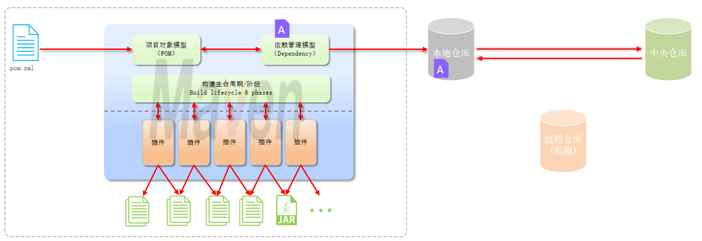
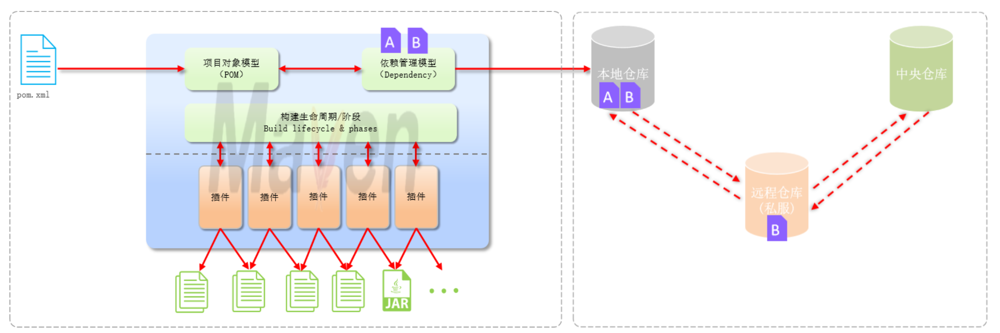
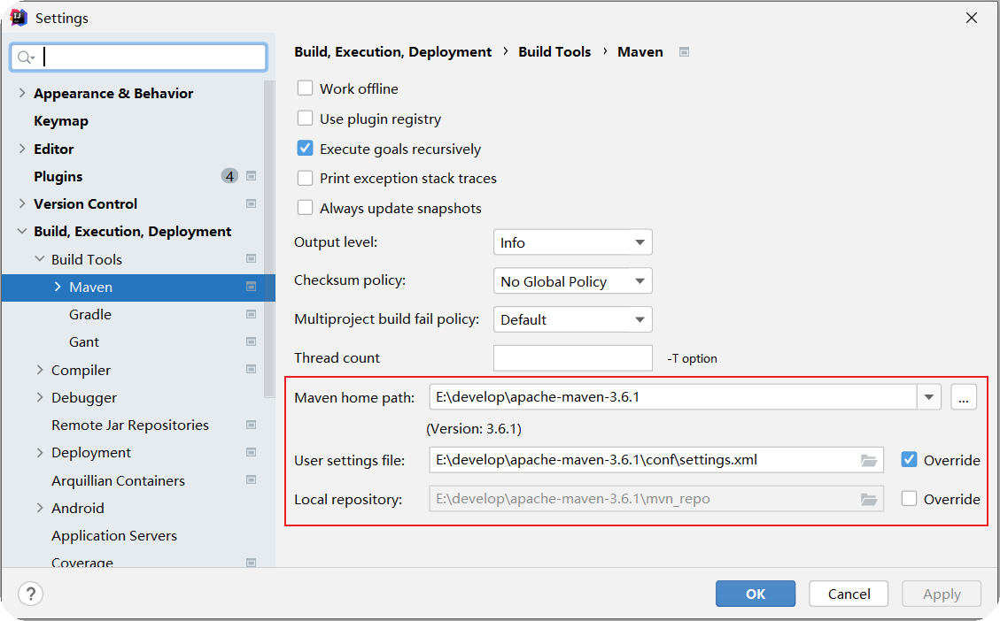
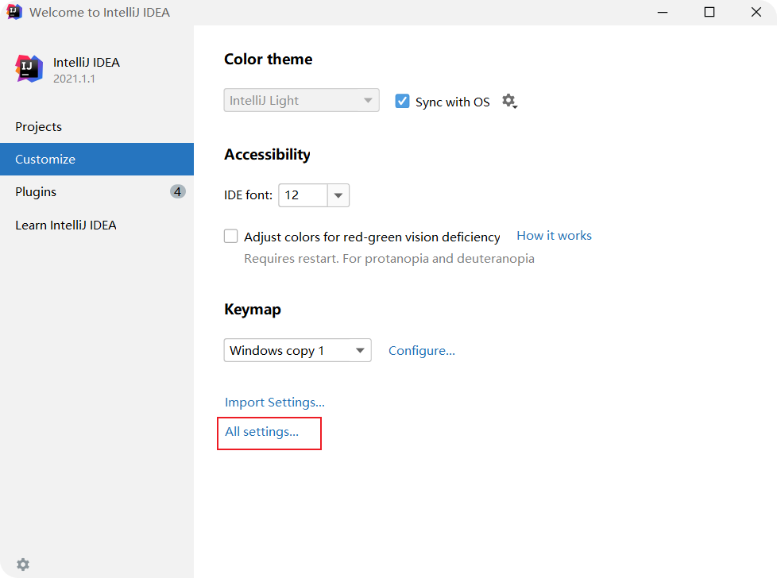
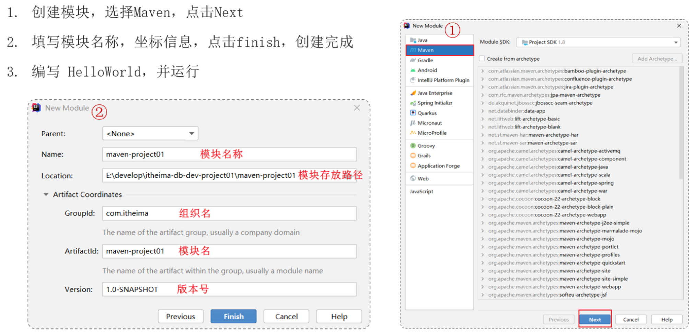
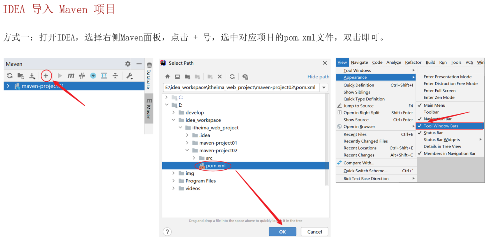
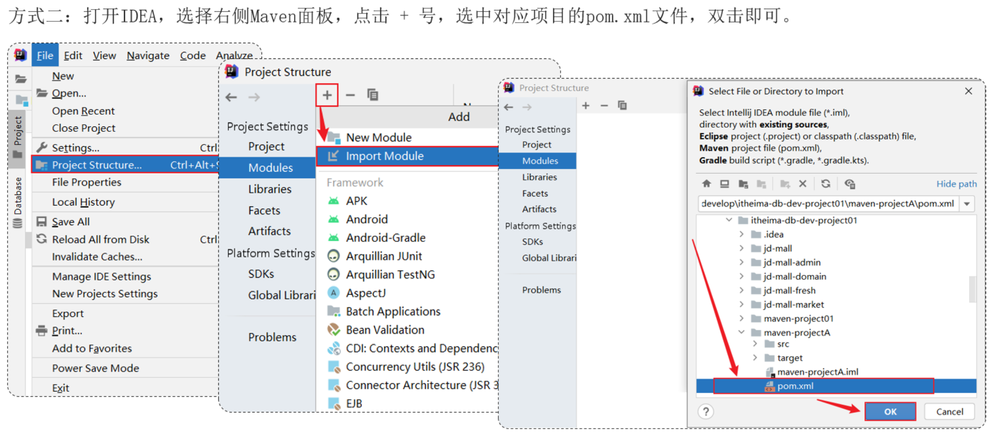
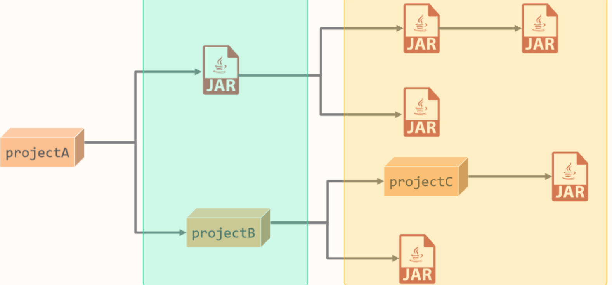
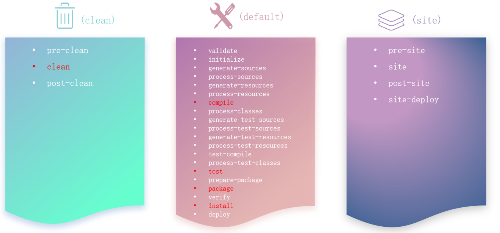

### 1. 什么是 Maven？

**Apache Maven** 是一个由 Apache 软件基金会开发和维护的 **项目管理工具**，主要用于 **Java 项目的构建、依赖管理和项目信息管理**。Maven 基于 POM（Project Object Model）模型，强调“约定优于配置”（Convention over Configuration）。

---

### 2. Maven 能做什么？


* **依赖管理**：自动下载并管理项目所需的 jar 包和其传递依赖。
* **统一项目结构**：提供标准的项目结构和生命周期管理。
* **项目自动化构建**：编译、测试、打包、部署等流程自动化。标准跨平台（Linux、Windows、MacOS）

---

### 3. Maven 的核心概念

#### 3.1. POM（Project Object Model）

* Maven 项目的核心配置文件是 `pom.xml`
* 定义了项目信息、依赖、插件、构建配置等

示例（简化）：

```xml
<project>
  <modelVersion>4.0.0</modelVersion>
  <groupId>com.example</groupId>
  <artifactId>demo-project</artifactId>
  <version>1.0.0</version>
</project>
```

#### 3.2. 坐标（Coordinates）

用于唯一标识一个构件（artifact），包括：

* `groupId`：组织/公司/项目名，如 `org.springframework`
* `artifactId`：模块名，如 `spring-core`
* `version`：版本号，如 `5.3.29`

#### 3.3. 仓库（Repository）

* **本地仓库**：默认在用户主目录 `~/.m2/repository`
* **中央仓库**：Maven 官方的远程仓库（默认使用）
* **私服/镜像仓库**：如 Nexus、Artifactory 等
  

  



---

### 4. Maven 项目的标准目录结构

```
project/
│
├── src/
│   ├── main/
│   │   ├── java/          # 源码
│   │   └── resources/     # 配置文件
│   └── test/
│       ├── java/          # 测试代码
│       └── resources/     # 测试资源
│
├── target/                # 构建输出目录
└── pom.xml                # 项目配置文件
```

---
### 5. 配置 & 创建 & 导入Maven项目

#### 5.1. 配置本地仓库和私服（阿里云私服）

**修改配置文件 `settings.xml`**

```xml
<!-- 配置本地仓库：修改 conf/settings.xml 中的 <localRepository> 为一个指定目录。 -->
<localRepository>E:\develop\apache-maven-3.6.1\mvn_repo</localRepository>

<!-- 配置阿里云私服：修改 conf/settings.xml 中的 <mirrors> 标签，为其添加如下子标签： -->
<mirror>
    <id>alimaven</id>
    <name>aliyun maven</name>
    <url>http://maven.aliyun.com/nexus/content/groups/public/</url>
    <mirrorOf>central</mirrorOf>
</mirror>
```

测试：`mvn -v`

**配置IDEA：**
1. 当前工程
   * 选择 IDEA中 File --> Settings --> Build,Execution,Deployment --> Build Tools --> Maven
   * 设置 IDEA 使用本地安装的 Maven，并修改配置文件及本地仓库路径
   * 
2. 全局
   * 

#### 5.2. 创建



#### 5.3. 导入

1. 方法一

    

2. 方法二
   


### 6. 依赖管理

#### 6.1. 依赖配置

依赖：指当前项目运行所需要的jar包，一个项目中可以引入多个依赖。

配置方法：

1. 在 pom.xml 中编写 <dependencies> 标签
2. 在 <dependencies> 标签中 使用 <dependency> 引入坐标
3. 定义坐标的 groupId，artifactId，version
4. 点击刷新按钮，引入最新加入的坐标

> 如果引入的依赖，在本地仓库不存在，将会连接远程仓库/中央仓库，然后下载依赖。（这个过程会比较耗时，耐心等待）
如果不知道依赖的坐标信息，可以到 https://mvnrepository.com/ 中搜索


#### 6.2. 依赖传递

依赖具有**传递性**

* 直接依赖：在当前项目中通过依赖配置建立的依赖关系
* 间接依赖：被依赖的资源如果依赖其他资源，当前项目间接依赖其他资源

    

**排除依赖**

排除依赖指主动断开依赖的资源，被排除的资源无需指定版本

```xml
<!-- 在A项目中添加了B项目做依赖-->
<dependency>
    <groupId>com.itheima</groupId>
    <artifactId>maven-projectB</artifactId>
    <version>1.0-SNAPSHOT</version>
    <!-- 排除B项目中的junit依赖-->
    <exclusions>
        <exclusion>
            <groupId>junit</groupId>
            <artifactId>junit</artifactId>
        </exclusion>
    </exclusions>
</dependency>
```


#### 6.3. 依赖范围

依赖的jar包，默认情况下，可以在任何地方使用。可以通过 `<scope>…</ scope >` 设置其作用范围

作用范围：
* 主程序范围有效。（main文件夹范围内）
* 测试程序范围有效。（test文件夹范围内）
* 是否参与打包运行。（package指令范围内）

scope值 | 主程序 | 测试程序 | 打包（运行） | 范例
------- | ------- | ------- | ------- | -------
compile（默认） | Y | Y | Y | log4j
test | - | Y | - | junit
provided | Y | Y | - | servlet-api
runtime | - | Y | Y | jdbc驱动

#### 6.4. 生命周期

Maven 定义了一套 **生命周期（Lifecycle）**，常用的有三个：

* **clean**：清理上次构建的结果
* **default（构建）**：核心生命周期，如 `clean`, `compile`, `test`, `package`, `install`
* **site**：生成项目文档

**每套生命周期包含一些阶段（phase），阶段是有顺序的，后面的阶段依赖于前面的阶段**




---

### 7. Maven 的工作流程

构建流程如下：

`clean`：移除上一次构建生成的文件
`compile`：编译项目源代码
`test`：使用合适的单元测试框架运行测试(junit)
`package`：将编译后的文件打包，如：jar、war等
`install`：安装项目到本地仓库

**在同一套生命周期中，当运行后面的阶段时，前面的阶段都会运行**

---

### 8. 常用 Maven 命令

```bash
mvn clean             # 清理项目
mvn compile           # 编译源码
mvn test              # 执行测试
mvn package           # 打包
mvn install           # 安装到本地仓库
mvn deploy            # 发布到远程仓库
mvn dependency:tree   # 查看依赖树
```
