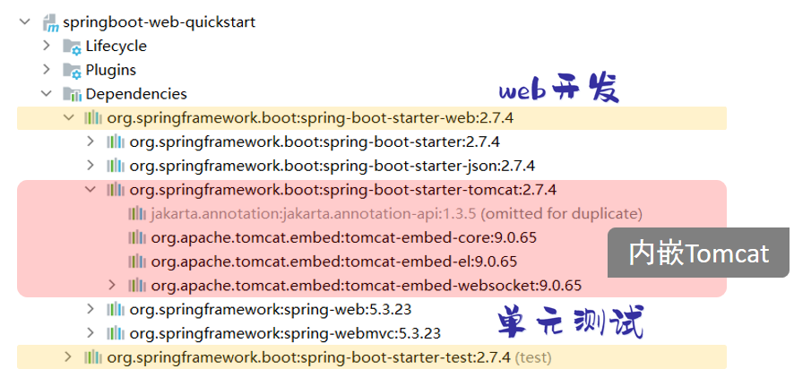
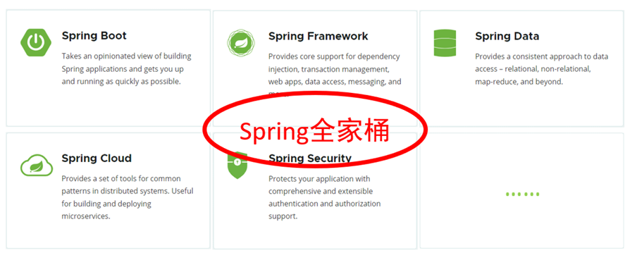
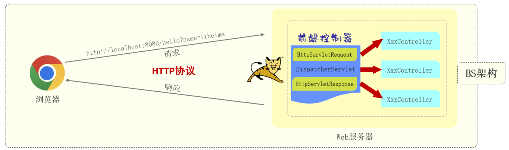
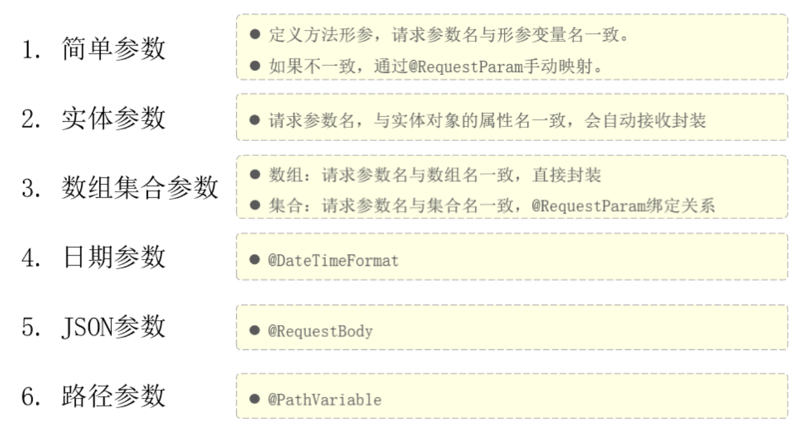
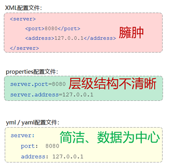
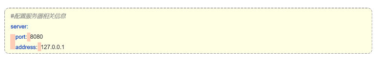
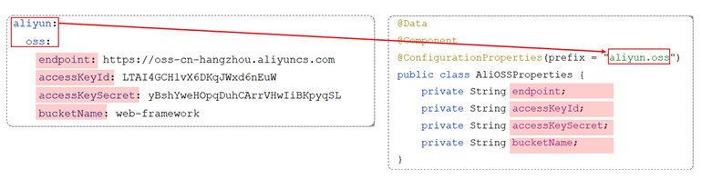
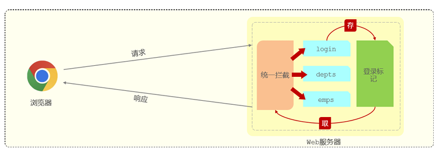

## 1. SpringBootWeb入门

* spring-boot-starter-web：包含了web应用开发所需要的常见依赖。
* spring-boot-starter-test：包含了单元测试所需要的常见依赖。

官方提供的starter：https://docs.spring.io/spring-boot/docs/2.7.4/reference/htmlsingle/#using.build-systems.starters

SpringBootWeb中有内嵌Tomcat，不需要再配置Tomcat


### 1.1. 什么是SPring

官网：https://spring.io/



Spring中最基础、最核心的是 `SpringFramework`，其他Spring家族的技术都是基于 `SpringFramework` 的。

`SpringFramework` 的核心功能/特点：

* **依赖注入 (DI)**：通过 IoC (控制反转) 容器管理对象及其依赖关系

* **面向切面编程 (AOP)**：支持横切关注点的模块化

* **数据访问支持**：简化 JDBC、ORM 框架集成

* **事务管理**：声明式事务管理

* **MVC 框架**：用于构建 Web 应用程序

* **灵活性**：高度可配置，但需要大量 XML 或 Java 配置

`SpringFramework` 的缺点：1. 配置繁琐；2. 入门难度大
所以 `SpringBoot` 简化了配置，可以快速开发

## 2. Web程序基础

---

### 2.1. 什么是 Web 程序？

* Web 程序是一种 **基于浏览器/客户端 和 服务器端通信** 的应用程序。
* 客户端发送请求，服务器处理并响应。
* 通信使用的是 **HTTP 协议（HyperText Transfer Protocol）**。

---

### 2.2. HTTP 协议简介

#### 2.2.1. HTTP 的本质

* 是一种 **基于文本的、无状态的请求-响应协议**。
* 客户端发起请求（Request），服务器返回响应（Response）。

#### 2.2.2. 一个典型的 HTTP 请求

```
GET /index.html HTTP/1.1
Host: localhost:8080
User-Agent: Mozilla/5.0
Accept: text/html
```

#### 2.2.3. 一个典型的 HTTP 响应

```
HTTP/1.1 200 OK
Content-Type: text/html
Content-Length: 1024

<html>
  <body>Hello</body>
</html>
```

---

#### 2.2.4. 直接使用 HTTP 编程的复杂性

* 必须手动：

  * **监听端口**
  * **接收 Socket 数据**
  * **解析请求格式（如 GET /path HTTP/1.1）**
  * **解析 Header、Body**
  * **生成响应格式**
* 错误容易发生，不易维护，因此我们一般**不会手写这些底层细节**。

---

#### 2.2.5. 为什么使用 Web 框架 / 容器？

* **Tomcat、Jetty、Spring Boot** 等平台：

  * 帮我们封装了对 **Socket 和 HTTP 协议的解析**
  * 我们只需要写业务逻辑（如 Controller）
  * 更专注于功能实现，而不是协议细节

---

### 2.3. 自定义 Web 服务器

> 用 Java 实现一个最简单的 Web 服务器（仅支持 GET / 请求）。

#### 2.3.1. 核心流程：

1. 创建 `ServerSocket`，监听端口
2. 接受客户端连接，开启线程处理
3. 读取并解析 HTTP 请求
4. 根据请求生成响应内容
5. 写回 HTTP 响应给客户端

#### 2.3.2. 示例代码简要说明：

```java
ServerSocket ss = new ServerSocket(8080); // 监听 8080 端口
Socket sock = ss.accept(); // 接收客户端连接
```

**处理请求与响应的核心逻辑：**

```java
String first = reader.readLine(); // 读取首行
if (first.startsWith("GET / HTTP/1.")) {
    // 合法请求，返回200 + HTML页面
} else {
    // 非法请求，返回404
}
```

**读取 HTML 文件作为响应体：**

```java
InputStream is = Server.class.getClassLoader().getResourceAsStream("html/a.html");
BufferedReader br = new BufferedReader(new InputStreamReader(is));
```

---

#### 2.3.3. 关键知识点总结

| 名称               | 说明                    |
| ---------------- | --------------------- |
| `ServerSocket`   | 用于监听端口，接受客户端连接        |
| `Socket`         | 表示一个连接通道，读写数据         |
| `BufferedReader` | 读取客户端请求内容             |
| `BufferedWriter` | 向客户端写回响应              |
| `Content-Length` | 指定响应体的字节长度，必须正确       |
| `\r\n`空行         | 标识 Header 和 Body 的分隔点 |

---

#### 2.3.4. 响应 HTML 页面流程图

```
浏览器发起 HTTP 请求
        ↓
ServerSocket 接收连接
        ↓
Handler 线程读取请求
        ↓
读取本地 a.html 内容
        ↓
封装 HTTP 响应头和 HTML 内容
        ↓
写回给浏览器
        ↓
浏览器渲染 HTML 页面
```

---

#### 2.3.5. 这种原生实现的局限

* 只支持简单请求（如 GET ）
* 不支持 POST、参数解析、多线程池、高并发
* 无日志、无热部署、无Servlet容器
* 不具备企业级能力，仅用于**学习原理**

---
### 2.4. Web服务器：Tomcat

**Tomcat**：Apache 软件基金会一个核心项目，是一个开源免费的轻量级Web服务器，支持Servlet/JSP少量JavaEE规范。

**JavaEE**：Java Enterprise Edition，Java企业版。指Java企业级开发的技术规范总和。包含13项技术规范：JDBC、JNDI、EJB、RMI、JSP、Servlet、XML、JMS、Java IDL、JTS、JTA、JavaMail、JAF

Tomcat 也被称为 Web容器、Servlet容器。Servlet程序需要依赖于 Tomcat才能运行 

官网：https://tomcat.apache.org/


## 3. 请求 & 响应注解
**请求（HttpServletRequest）**：获取请求数据
**响应（HttpServletResponse）**：设置响应数据
**BS架构**：Browser/Server，浏览器/服务器架构模式。客户端只需要浏览器，应用程序的逻辑和数据都存储在服务端。【维护方便 体验一般】
**CS架构**：Client/Server，客户端/服务器架构模式。需要下载客户端程序。【开发、维护麻烦 体验不错】



### 3.1. 请求



#### 3.1.1. 简单参数【Servlet API & SpringBoot】

1. 原始方式（Servlet API 方式）
    ```java
    //Controller方法形参中声明HttpServletRequest对象
    //调用对象的getParameter(参数名)
    // 繁琐，手动类型转换
    /*
    注解与映射：@RequestMapping("/simpleParam") 是 Spring MVC 中的注解
    用于将 /simpleParam 这个请求路径映射到当前方法 simpleParam 上
    当客户端访问该路径时，会执行此方法。

    通过 HttpServletRequest 获取前端传递的 name 和 age 参数
    将 age 从字符串手动转换为整数类型，然后在控制台打印参数信息，最后返回字符串 OK 
    不过这种方式存在一些不足，比如手动类型转换可能因参数格式问题抛出异常
    */
    @RequestMapping("/simpleParam")
    public String simpleParam(HttpServletRequest request) {
            String name = request.getParameter("name");
            String ageStr = request.getParameter("age");
            int age = Integer.parseInt(ageStr);
            System.out.println(name + " : " + age);
            return "OK";
    }
    ```
2. SpringBoot中接收简单参数
   ```java
    //请求参数名与方法形参变量名相同
    //会自动进行类型转换
    /*
    参数接收：方法直接声明了 String name 和 Integer age 作为参数
    在 Spring MVC 环境下，默认会尝试从请求参数中获取对应名称（name 和 age ）的值
    并自动进行类型转换（比如前端传字符串形式的数字，可转成 Integer 类型 ）来注入到参数中
    */
    @RequestMapping("/simpleParam")
    public String simpleParam(String name, Integer age) {
        System.out.println(name + " : " + age);
        return "OK";
    }
    ```
3. @RequestParam注解（如果方法形参名称与请求参数名称不匹配，可以使用 @RequestParam 完成映射）
   ```java
    //方法形参名称与请求参数名称不匹配，通过该注解完成映射
    //该注解的required属性默认是true，代表请求参数必须传递
    /*
    @RequestParam(name = "name")：用于绑定请求参数
    这里指定将请求中名为 name 的参数值赋给方法参数 username ，实现了请求参数名和方法参数名不同时的绑定。
    而 Integer age 没有显式加 @RequestParam 注解时，在 Spring MVC 环境下，默认会尝试按参数名（age ）去请求中查找对应参数进行绑定 。
    */
    @RequestMapping("/simpleParam")
    public String simpleParam(@RequestParam(name = "name", required = false) String username, Integer age)     {
        System.out.println(username + " : " + age);
        return "OK";
    }
    ```
    `@RequestParam` 中的 **required属性默认为true**，代表该请求参数必须传递，如果不传递将报错。 如果该参数是可选的，可以将required属性设置为false。


#### 2.1.2. 实体参数

简单实体对象：请求参数名与形参对象属性名相同，定义POJO接收即可（可以定义DTO）

```java
@RequestMapping("/simplePojo")
public String simplePojo(User user){
    System.out.println(user);
    return "OK";
}

public class User {
    private String name;
    private Integer age;
}
```


> POJO 是 Plain Old Java Object 的缩写，中文可译为 "普通 Java 对象" 或 "简单 Java 对象"
> 
> POJO 的核心特性:
> 1. 无特殊继承或实现
>       不强制继承特定类（如 EJB、EntityBean 等）或实现特定接口（如 Serializable、Remote 等）。
>       仅依赖 Java 语言本身的基础特性。
> 2. 私有属性与公共访问方法
>       通过 private 关键字封装属性，提供 public 的 getter/setter 方法访问和修改属性。
>       示例：
>       ```java
>       public class User {
>           private String name;  // 私有属性
>           private Integer age;  // 私有属性
>           
>           public String getName() { return name; }  // getter
>           public void setName(String name) { this.name = name; }  // setter
>           
>           public Integer getAge() { return age; }
>           public void setAge(Integer age) { this.age = age; }
>       }
>       ```
>3. 无特殊业务逻辑
>       通常只包含数据和基本操作（如数据验证、计算属性值等），不承担复杂业务逻辑


#### 3.1.2. 数组集合参数

1. 数组参数：请求参数名与形参数组名称相同且请求参数为多个，定义数组类型形参即可接收参数
   ```java
   // 请求参数名与形参中数组变量名相同，可以直接使用数组封装
   // http://localhost:8080/arrayParam?hobby=game&hobby=java

   @RequestMapping("/arrayParam")
   public String arrayParam(String[] hobby) {
       System.out.println(Arrays.toString(hobby));
       return "OK";
   }
   ```

2. 集合参数：请求参数名与形参集合名称相同且请求参数为多个，@RequestParam 绑定参数关系
   ```java
   // 请求参数名与形参中集合变量名相同，通过@RequestParam绑定参数关系
   // http://localhost:8080/listParam?hobby=game&hobby=java

   @RequestMapping("/listParam")
   public String listParam(@RequestParam List<String> hobby) {
       System.out.println(hobby);
       return "OK";
   }
   ```
#### 3.1.3. 日期参数

日期参数：使用 `@DateTimeFormat` 注解完成日期参数格式转换

```java
// http://localhost:8080/dateParam?updateTime=2022-12-1210:00:05
@RequestMapping("/dateParam")
public String dateParam(@DateTimeFormat(pattern = "yyyy-MM-dd HH:mm:ss") LocalDateTime updateTime) {
    System.out.println(updateTime);
    return "OK";
}
```

#### 3.1.4. Json参数

JSON参数：JSON数据键名与形参对象属性名相同，定义POJO类型形参即可接收参数，需要使用 `@RequestBody` 标识

```json
{
    "name":"Tom",
    "age":10,
    "address":{
        "province":"beijing",
        "city":"beijing"
    }
}
```

```java
@RequestMapping("/jsonParam")
public String jsonParam(@RequestBody User user){
    System.out.println(user);
    return "OK";
}

public class User {
    private String name;
    private Integer age;
    private Address address;
}

public class Address {
    private String province;
    private String city;
}
```

#### 3.1.5. 路径参数

路径参数：通过请求URL直接传递参数，使用{…}来标识该路径参数，需要使用 `@PathVariable` 获取路径参数

```java
 // http://localhost:8080/path/1/Tom 等（id 和 name 为路径中动态部分 ）

@RequestMapping("/path/{id}/{name}")
public String pathParam2(@PathVariable Integer id, @PathVariable String name) {
    System.out.println(id + " : " + name);
    return "OK";
}
```

#### 3.1.6. 相关注解总结

| 注解                | 作用说明                           | 适用场景                    | 主要属性及默认值                                                                                                     |
| ----------------- | ------------------------------ | ----------------------- | ------------------------------------------------------------------------------------------------------------ |
| `@RequestMapping` | 将请求路径映射到 Controller 方法         | 所有类型请求（可细化为 GET/POST 等） | - `value`/`path`：映射路径<br>- `method`：支持的 HTTP 方法（默认全支持）                                                       |
| `@RequestParam`   | 绑定请求参数到方法入参                    | 简单参数、数组/集合参数            | - `name`（或 `value`）：请求参数名<br>- `required`：是否必需，默认 `true`<br>- `defaultValue`：默认值，若设置则 `required` 自动为 `false` |
| `@DateTimeFormat` | 将字符串格式的日期时间参数转为 `java.time` 类型 | 接收日期/时间类型参数             | - `pattern`：日期时间格式模板（如 `"yyyy-MM-dd HH:mm:ss"`）                                                              |
| `@RequestBody`    | 将请求体（通常为 JSON）反序列化为 POJO       | 接收 JSON 或其他媒体类型请求体      | 无                                                                                                            |
| `@PathVariable`   | 绑定 URL 路径中的动态占位符到方法入参          | RESTful 风格路径参数          | - `name`（或 `value`）：占位符名称<br>- `required`：是否必需，默认 `true`                                                     |


### 3.2. 响应

@ResponseBody

类型：方法注解、类注解
位置：Controller方法上/类上
作用：1️⃣将方法返回值直接响应；2️⃣如果返回值类型是 实体对象/集合 ，将会转换为JSON格式响应

说明：@RestController = @Controller + @ResponseBody ;

定义统一的响应结果类（Result）

## 4. 分层解耦

### 4.1. 三层架构

`controller`：控制层，接收前端发送的请求，对请求进行处理，并响应数据。
`service`：业务逻辑层，处理具体的业务逻辑。
`dao`：数据访问层(Data Access Object)（持久层），负责数据访问操作，包括数据的增、删、改、查。

### 4.2. 分层解耦

内聚：软件中各个功能模块内部的功能联系。
耦合：衡量软件中各个层/模块之间的依赖、关联的程度。
软件设计原则：高内聚低耦合。

💡**解耦操作：控制反转 + 依赖注入**

**控制反转**： Inversion Of Control，简称 `IOC`。对象的创建控制权由程序自身转移到外部（容器），这种思想称为控制反转。
**依赖注入**： Dependency Injection，简称 `DI`。容器为应用程序提供运行时，所依赖的资源，称之为依赖注入。
**Bean对象**：IOC容器中创建、管理的对象，称之为 `bean`。

>
> ```java
> @RestController
> public class EmpController {
>     // ① 这里自己 new 了一个 EmpServiceImpl —— 强依赖
>     private EmpService empService = new EmpServiceImpl();
> 
>     @RequestMapping("/listEmp")
>     public Result list() {
>         // ② 只能调用固定实现，且控制层直接管业务层的创建
>         List<Emp> empList = empService.listEmp();
>         return Result.success(empList);
>     }
> }
> ```
> 这样写的问题在于：
> 1. 控制层（Controller）和业务层（Service）“绑”得太紧，任何想换个实现（比如从 EmpServiceImpl 换到 EmpServiceBImpl），都得改源码里 new 的那一行。
> 2. 测试也很麻烦，没法轻松地“塞”一个假的 EmpService 进来做单元测试。

### 4.3. IOC & DI入门


**步骤**：
1. **将 Service 层、Dao 层的实现类交给 IOC 容器管理**
   在实现类上加 `@Component`（或更细化的 `@Service`/`@Repository`）注解，Spring 启动时会扫描并实例化它们。

2. **在需要用到依赖的地方注入对象**
   在 Controller、Service 等类的字段、构造器或 `setter` 上加 `@Autowired`，告诉 Spring “请给我注入一个该类型的 Bean”。

3. **运行并验证**
   启动 Spring Boot 应用后，访问 Controller 的 URL，观察依赖是否正确注入，以及逻辑是否按预期执行。

**示例代码**

1️⃣**定义接口**

```java
public interface EmpService {
    List<Emp> listEmp();
}
```

2️⃣**两个实现类，交给容器管理**

```java
// Bean 名称为 "empServiceA"
@Service("empServiceA")
public class EmpServiceA implements EmpService {
    @Override
    public List<Emp> listEmp() {
        // A 实现的逻辑
        System.out.println("调用 A 实现");
        return Collections.emptyList();
    }
}

// Bean 名称为 "empServiceB"
@Service("empServiceB")
public class EmpServiceB implements EmpService {
    @Override
    public List<Emp> listEmp() {
        // B 实现的逻辑
        System.out.println("调用 B 实现");
        return Collections.emptyList();
    }
}
```

> **说明**：
>
> * `@Service` 本质上等同于 `@Component`，只是语义更明确、可读性更好
> * `("empServiceA")` 这串名字就是 Bean 的 `id`，不写时默认是类名首字母小写 (`empServiceA`)

3️⃣**Controller 中注入并使用**

```java
@RestController
@RequestMapping("/emp")
public class EmpController {

    // 注入时指定要用哪个 Bean
    @Autowired
    @Qualifier("empServiceA")   // 改成 "empServiceB" 就会用 B 实现
    private EmpService empService;

    @GetMapping("/list")
    public Result list() {
        List<Emp> list = empService.listEmp();
        return Result.success(list);
    }
}
```

* **切换实现**：

  * 用 A：`@Qualifier("empServiceA")`
  * 用 B：`@Qualifier("empServiceB")`
    切换时只要改注解，不改 Controller 里其它代码。


### 4.4. IOC详解

#### 4.4.1. Bean的声明

要把某个对象交给IOC容器管理，需要在对应的类上加上如下注解之一

注解 | 说明 | 位置
------- | ------- | -------
@Component | 声明bean的基础注解 | 不属于以下三类时，用此注解
@Controller | @Component的衍生注解 | 标注在控制器类上
@Service | @Component的衍生注解 | 标注在业务类上
@Repository | @Component的衍生注解 | 标注在数据访问类上（由于与mybatis整合，用的少）


* 声明bean的时候，可以通过value属性指定bean的名字，如果没有指定，默认为类名首字母小写。
* 使用以上四个注解都可以声明bean，但是在springboot集成web开发中，声明控制器bean只能用@Controller。

#### 4.4.2. Bean组件扫描

前面声明bean的四大注解，要想生效，还需要被组件扫描注解 `@ComponentScan` 扫描。

`@ComponentScan` 注解虽然没有显式配置，但是实际上已经包含在了启动类声明注解 `@SpringBootApplication` 中，默认扫描的范围是启动类所在包及其子包。

不推荐添加 `@ComponentScan` 注解，要把所有内容放在启动类所在包及其子包中。


### 4.5. DI详解

#### 4.5.1. Bean注入

`@Autowired` 注解，默认是按照类型进行，如果存在多个相同类型的bean，将会报错

通过以下几种方案来解决：
1. `@Primary` / `@Qualifier`
2. `@Resource`

`@Autowired` 是spring框架提供的注解，而 `@Resource` 是JDK提供的注解。
`@Autowired` 默认是按照类型注入，而 `@Resource` 默认是按照名称注入。


## 配置文件

### 配置参数

**问题分析**：参数硬编码，分散不好管理

**解决方法**：
1. 把参数写入配置文件 `application.properties`
> 因为application.properties是springboot项目默认的配置文件，所以springboot程序在启动时会默认读取application.properties配置文件

2. 使用 `@Value` 注解（用于外部配置的属性注入）
> 具体用法为： `@Value("${配置文件中的key}")`

示例：

- 原代码
    ```java
    @Component
    public class AliOSSUtils {
        private String endpoint = "https://oss-cn-hangzhou.aliyuncs.com";
        private String accessKeyId = "LTAI4GCH1vX6DKqJWxd6nEuW";
        private String accessKeySecret = "yBshYweHOpgDuhCArrVHwiBKpyqSL";
        private String bucketName = "web-tlias";
        //省略其他代码...
    }
    ```
- 修改后
    ```properties
    #自定义的阿里云oss配置信息
    aliyun.oss.endpoint=https://oss-cn-hangzhou.aliyuncs.com
    aliyun.oss.accessKeyId=LTAI4GCH1vX6DKqJWxd6nEuW
    aliyun.oss.accessKeySecret=yBshYweHOpqDuhCArrVHwiBKpyqSL
    aliyun.oss.bucketName=web-tlias
    ```
    ```java
    @Component
    public class AliOSSUtils {

        @Value("${aliyun.oss.endpoint}")
        private String endpoint;

        @Value("${aliyun.oss.accessKeyId}")
        private String accessKeyId;

        @Value("${aliyun.oss.accessKeySecret}")
        private String accessKeySecret;

        @Value("${aliyun.oss.bucketName}")
        private String bucketName;
        //省略其他代码...
    }
    ```

### yml配置文件

SpringBoot 支持多种配置文件格式，如：properties、xml、yml等


yml 格式的配置文件，后缀名有两种：
* yml （推荐）
* yaml

#### yml基本语法

- 大小写敏感  
- 数值前边必须有 **空格** ，作为分隔符  
- 使用缩进表示层级关系，缩进时，不允许使用Tab键，只能用空格（idea中会自动将Tab转换为空格）  
- 缩进的空格数目不重要，只要相同层级的元素左侧对齐即可  
- `#` 表示注释，从这个字符一直到行尾，都会被解析器忽略



#### yml数据格式

最常见的两类
1. 定义 对象/Map集合
2. 定义 数组/list/set集合

**对象/Map集合**

```yml
user
  name: zhangsan
  age: 18
  address: beijing
```

**数组/list/set集合**
```yml
hobby:
  - java
  - game
  - sport
```

###  `@ConfigurationProperties`

- `@Value` 注解只能一个一个的进行外部属性的注入。  
- `@ConfigurationProperties` 可以批量的将外部的属性配置注入到bean对象的属性中。

方法：
1. 创建一个实体类，且 **实体类中的属性名** 和 **配置文件中key的名字** 必须要一致
2. 需要将实体类交给Spring的IOC容器管理，成为IOC容器当中的bean对象
3. 在实体类上添加 `@ConfigurationProperties` 注解，并通过 `perfix` 属性来指定配置参数项的前缀


> 引入一个依赖可以消除红色警告 `Spring Boot Configuration Annotation Processor not configured`
> 这项依赖它的作用就是会自动的识别被 `@Configuration Properties` 注解标识的bean对象

```xml
<dependency>
    <groupId>org.springframework.boot</groupId>
    <artifactId>spring-boot-configuration-processor</artifactId>
</dependency>
```

## 登录模块

### 登录校验实现

因为HTTP协议是无状态的，所以下一次请求不会携带上一次请求的数据，解决方法为以下两步
1. 在员工登录成功后，需要将用户登录成功的信息存起来，记录用户已经登录成功的标记。【会话技术】
2. 在浏览器发起请求时，需要在服务端进行统一拦截，拦截后进行登录校验。【统一拦截技术】
   - Servlet 规范中的 Filter过滤器
   - Spring 提供的 Interceptor拦截器



### 会话技术

在web开发当中，会话指的就是浏览器与服务器之间的一次连接，我们就称为一次会话。

**会话：**用户打开浏览器，访问web服务器的资源，会话建立，直到有一方断开连接，会话结束。在一次会话中可以包含多次请求和响应。

**会话跟踪：**一种维护浏览器状态的方法，服务器需要识别多次请求是否来自于同一浏览器，以便在同一次会话的多次请求间共享数据。

**会话跟踪方案：**
* 客户端会话跟踪技术：Cookie
* 服务端会话跟踪技术：Session
* 令牌技术

#### 方案1：Cookie

**数据存储在客户端浏览器当中**

- 服务器会 **自动** 的将 cookie 响应给浏览器。  
- 浏览器接收到响应回来的数据之后，会 **自动** 的将 cookie 存储在浏览器本地。  
- 在后续的请求当中，浏览器会 **自动** 的将 cookie 携带到服务器端。

**为什么都是自动进行的？**

是因为 cookie 它是 HTTP 协议当中所支持的技术，而各大浏览器厂商都支持了这一标准。在 HTTP 协议官方给我们提供了一个响应头和请求头：

- 响应头 Set-Cookie ：设置 Cookie 数据的  
- 请求头 Cookie: 携带 Cookie 数据的

**优缺点：**
- **优点:** HTTP协议中支持的技术 (像Set-Cookie 响应头的解析以及 Cookie 请求头数据的携带，都是浏览器自动进行的，是无需我们手动操作的)  
- **缺点:**  
  - 移动端APP(Android、IOS)中无法使用Cookie  
  - 不安全，用户可以自己禁用Cookie  
  - Cookie不能跨域
>   **跨域**：跨域区分三个维度（协议 / ip / 端口）只要上述的三个维度有任何一个维度不同，那就是跨域操作
> **前后端分离** 的项目，前端和后端的服务器一般会分开部署，前端和后端的IP地址和端口号都不同（比如前端在 `192.168.150.200:80`，后端在 `192.168.150.100:8080`）


#### 方案2：Session


### JWT令牌

### Filter过滤器

### Interceptor拦截器
