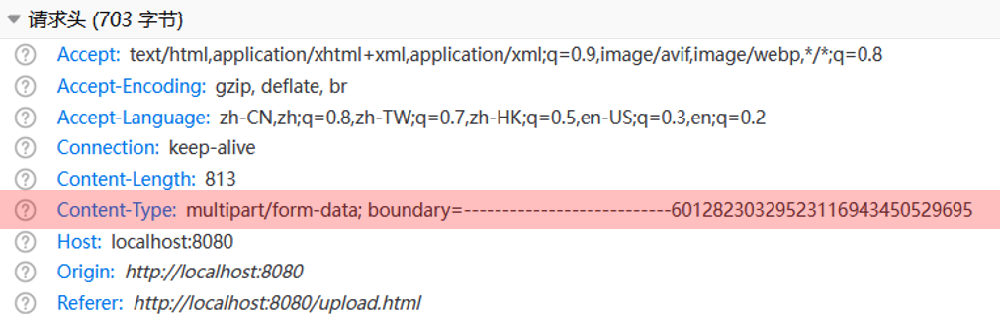
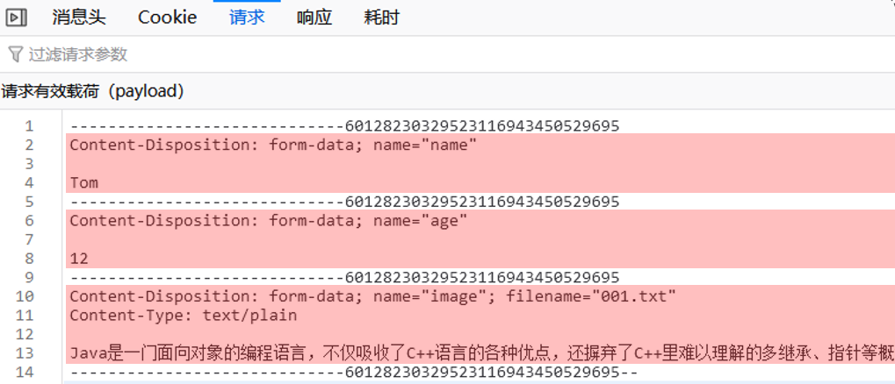

## 分页插件PageHelper

原始方式的分页代码：**【步骤固定，代码繁琐】**

* EmpMapper
    ```java
    //查询总记录数
    @Select("select count(*) from emp")
    public Long count();

    //分页查询，获取列表数据
    @Select("select * from emp limit #{start},#{pageSize}")
    public List<Emp> page(Integer start, Integer pageSize);
    ```
* EmpMapperImpl
    ```java
    @Override
    public PageBean page(Integer page, Integer pageSize) {
        //1. 获取总记录数
        Long count = empMapper.count();
        //2. 获取分页查询结果列表
        Integer start = (page - 1) * pageSize;
        List<Emp> empList = empMapper.page(start, pageSize);
        //3. 封装PageBean对象
        PageBean pageBean = new PageBean(count, empList);
        return pageBean;
    }
    ```

使用插件：**【简洁高效】**
* EmpMapper
    ```java
    //员工信息查询
    @Select("select * from emp")
    public List<Emp> list();
    ```
* EmpMapperImpl
    ```java
    @Override
    public PageBean page(Integer page, Integer pageSize) {
        //1. 设置分页参数
        PageHelper.startPage(page,pageSize);    //select count(*) from emp;

        //2. 执行查询
        List<Emp> empList = empMapper.list();
        Page<Emp> p = (Page<Emp>) empList;  //select * from emp limit ?,?;

        //3. 封装PageBean对象
        PageBean pageBean = new PageBean(p.getTotal(), p.getResult());
        return pageBean;
    }
    ```


## 文件上传

### 前端页面三要素


```html
<form action="/upload" method="post" enctype="multipart/form-data">
    姓名: <input type="text" name="username"><br>
    年龄: <input type="text" name="age"><br>
    头像: <input type="file" name="image"><br>
    <input type="submit" value="提交">
</form>
```
1. `method="post"` **post方法**
2. `enctype="multipart/form-data"` 上传文件必须要选择这个，默认是`application/x-www-form-urlencoded`，如果是默认上传的只会是文件名，如果是 `multipart/form-data` 会有分割线，里面有文件名和文件内容 **multipart**
   
3. `type="file"`

### 本地存储

#### 文件名相关

使用原文件名可能存在重名的情况，我们使用 **UUID** 来生成文件名
**UUID** 是全局唯一标识符（Universally Unique Identifier）
文件名：**UUID** 拼接 **原文件扩展名** 也就是文件类型（截取原文件名最后一个.之后的字符串）

```java
@RestController
public class UploadController {

    @PostMapping("/upload")
    public Result upload(MultipartFile image) throws IOException {
        //获取原始文件名
        String originalFilename = image.getOriginalFilename();
        //构建新的文件名
        String newFileName = UUID.randomUUID().toString()+originalFilename.substring(originalFilename.lastIndexOf("."));
        //将文件保存在服务器端 E:/images/ 目录下
        image.transferTo(new File("E:/images/"+newFileName));
        return Result.success();
    }
}
```
#### 文件大小相关
在SpringBoot中，文件上传，默认单个文件允许最大大小为 1M。如果需要上传大文件，可以进行如下配置：
```yml
spring:
  servlet:
    multipart:
      # 配置单个文件最大上传大小
      max-file-size: 10MB
      # 配置单个请求最大上传大小（一次请求可以上传多个文件）
      max-request-size: 100MB
```

#### MultipartFile提供的常用方法

```java
String getOriginalFilename(); //获取原始文件名
void transferTo(File dest); //将接收的文件转存到磁盘文件中
long getSize(); //获取文件的大小，单位：字节
byte[] getBytes(); //获取文件内容的字节数组
InputStream getInputStream(); //获取接收到的文件内容的输入流
```

#### 本地存储的缺点

1. 前端无法直接访问
2. 磁盘满了无法处理
3. 磁盘坏了无法处理

### 阿里云OSS

OSS是阿里云提供的对象存储服务

#### 使用第三方服务的通用思路

1. 准备工作（注册账号之类的）
2. 参照官方SDK编写入门程序
    > SDK：Software Development Kit 的缩写，软件开发工具包，包括辅助软件开发的依赖（jar包）、代码示例等，都可以叫做SDK
    > 简单说，sdk中包含了我们使用第三方云服务时所需要的依赖，以及一些示例代码。我们可以参照sdk所提供的示例代码就可以完成入门程序
3. 集成使用

### 准备工作

- 注册阿里云（实名认证）
- 充值
- 开通对象存储服务(OSS)
- 创建 bucket 
- 获取 AccessKey（秘钥）

> Bucket：存储空间是用户用于存储对象（Object，就是文件）的容器，所有的对象都必须隶属于某个存储空间。


### 入门

打开阿里云OSS的官方文档，在官方文档中找到 SDK 的示例代码
参照官方提供的SDK，改造一下，即可实现文件上传功能

在以下代码中，需要替换的内容为：

- `accessKeyId`：阿里云账号AccessKey
- `accessKeySecret`：阿里云账号AccessKey对应的秘钥
- `bucketName`：Bucket名称
- `objectName`：对象名称，在Bucket中存储的对象的名称
- `filePath`：文件路径

```java
import com.aliyun.oss.ClientException;
import com.aliyun.oss.OSS;
import com.aliyun.oss.OSSClientBuilder;
import com.aliyun.oss.OSSException;
import com.aliyun.oss.model.PutObjectRequest;
import com.aliyun.oss.model.PutObjectResult;

import java.io.FileInputStream;
import java.io.InputStream;

public class AliOssTest {
    public static void main(String[] args) throws Exception {
        // Endpoint以华东1（杭州）为例，其它Region请按实际情况填写。
        String endpoint = "oss-cn-shanghai.aliyuncs.com";

        // 阿里云账号AccessKey拥有所有API的访问权限，风险很高。强烈建议您创建并使用RAM用户进行API访问或日常运维，请登录RAM控制台创建RAM用户。
        String accessKeyId = "XXX";
        String accessKeySecret = "XXX";

        // 填写Bucket名称，例如examplebucket。
        String bucketName = "web-framework01";
        // 填写Object完整路径，完整路径中不能包含Bucket名称，例如 exampledir/exampleobject.txt。
        String objectName = "1.jpg";
        // 填写本地文件的完整路径，例如D:\\localpath\\examplefile.txt。
        // 如果未指定本地路径，则默认从示例程序所属项目对应本地路径中上传文件流。
        String filePath = "C:\\Users\\Administrator\\Pictures\\1.jpg";

        // 创建OSSClient实例。
        OSS ossClient = new OSSClientBuilder().build(endpoint, accessKeyId, accessKeySecret);

        try {
            InputStream inputStream = new FileInputStream(filePath);
            // 创建PutObjectRequest对象。
            PutObjectRequest putObjectRequest = new PutObjectRequest(bucketName, objectName, inputStream);
            // 设置该属性可以返回response。如果不设置，则返回的response为空。
            putObjectRequest.setProcess("true");
            // 创建PutObject请求。
            PutObjectResult result = ossClient.putObject(putObjectRequest);
            // 如果上传成功，则返回200。
            System.out.println(result.getResponse().getStatusCode());
        } catch (OSSException oe) {
            System.out.println("Caught an OSSException, which means your request made it to OSS, "
                    + "but was rejected with an error response for some reason.");
            System.out.println("Error Message:" + oe.getErrorMessage());
            System.out.println("Error Code:" + oe.getErrorCode());
            System.out.println("Request ID:" + oe.getRequestId());
            System.out.println("Host ID:" + oe.getHostId());
        } catch (ClientException ce) {
            System.out.println("Caught an ClientException, which means the client encountered "
                    + "a serious internal problem while trying to communicate with OSS, "
                    + "such as not being able to access the network.");
            System.out.println("Error Message:" + ce.getMessage());
        } finally {
            if (ossClient != null) {
                ossClient.shutdown();
            }
        }
    }
}
```

运行以上程序后，会把本地的文件上传到阿里云OSS服务器上

### 集成

上传文件需要两个步骤
1. 上传图像，并把图像保存起来（存储到阿里云OSS）
2. 访问图像（通过图像在阿里云OSS的存储地址访问图像）
> OSS中的每一个文件都会分配一个访问的url，通过这个url就可以访问到存储在阿里云上的图片。所以需要把url返回给前端，这样前端就可以通过url获取到图像

1️⃣**引入阿里云OSS上传文件工具类（由官方的示例代码改造而来）**

因为不属于controller，service或者DAO，所以加 `@Component` 注解

```java
import com.aliyun.oss.OSS;
import com.aliyun.oss.OSSClientBuilder;
import com.aliyun.oss.model.PutObjectRequest;
import org.springframework.beans.factory.annotation.Value;
import org.springframework.stereotype.Component;
import org.springframework.web.multipart.MultipartFile;

import java.io.IOException;
import java.io.InputStream;
import java.util.UUID;

@Component
public class AliOSSUtils {

    @Value("${aliyun.oss.endpoint}")
    private String endpoint;
    @Value("${aliyun.oss.accessKeyId}")
    private String accessKeyId;
    @Value("${aliyun.oss.accessKeySecret}")
    private String accessKeySecret;
    @Value("${aliyun.oss.bucketName}")
    private String bucketName;

    public String upload(MultipartFile file) throws IOException {
        // 工具类生成唯一文件名
        String originalFilename = file.getOriginalFilename();
        String fileName = UUID.randomUUID().toString() +
                originalFilename.substring(originalFilename.lastIndexOf("."));

        // 创建OSSClient实例
        OSS ossClient = new OSSClientBuilder().build(endpoint, accessKeyId, accessKeySecret);

        try (InputStream inputStream = file.getInputStream()) {
            // 创建PutObjectRequest对象
            PutObjectRequest putObjectRequest = new PutObjectRequest(bucketName, fileName, inputStream);

            // 上传文件
            ossClient.putObject(putObjectRequest);

            // 上传成功后，返回文件访问路径
            return "https://" + bucketName + "." + endpoint + "/" + fileName;
        } finally {
            // 关闭OSSClient
            ossClient.shutdown();
        }
    }
}
```


2️⃣**修改controller**

```java
import com.itheima.pojo.Result;
import com.itheima.utils.AliOSSUtils;
import lombok.extern.slf4j.Slf4j;
import org.springframework.beans.factory.annotation.Autowired;
import org.springframework.web.bind.annotation.PostMapping;
import org.springframework.web.bind.annotation.RestController;
import org.springframework.web.multipart.MultipartFile;

import java.io.IOException;

@Slf4j
@RestController
public class UploadController {

    @Autowired
    private AliOSSUtils aliOSSUtils;

    @PostMapping("/upload")
    public Result upload(MultipartFile image) throws IOException {
        //调用阿里云oss工具类，将上传上来的文件存入阿里云
        String url = aliOSSUtils.upload(image);
        //将图片上传完成后的url返回，用于浏览器回显展示
        return Result.success(url);
    }
}
```